# amirelhalabi/liratek architecture

> Architecture diagram of the GitHub repository amirelhalabi/liratek, generated by GitDiagram from its file tree, README and a sample of source files (last updated 2026-10-03). It is an AI-made overview: check details against the source.

- Interactive diagram: https://gitdiagram.com/amirelhalabi/liratek
- Repository: https://github.com/amirelhalabi/liratek

## Overview

LiraTek is a point-of-sale and inventory system for phone and electronics shops, shipped as an offline-first Electron app and a multi-tenant web app. Staff use the renderer to manage stock, sell products and services, handle customer sessions and debts, and review financial records. Electron IPC and web REST are alternate transports into shared business logic and tenant-scoped SQLite storage; web tenancy adds host resolution and subscription entitlements. The README documents major capabilities, but many feature implementations were not sampled, so their internal links are omitted.

## Diagram (Mermaid)

```mermaid
flowchart TD

subgraph group_clients["Shop Applications"]
  node_renderer["React Renderer<br/>[App.tsx]"]
end

subgraph group_transports["Request Transports"]
  node_desktop["Electron Main<br/>[main.ts]"]
  node_ipc["IPC Handlers<br/>[sessionHandlers.ts]"]
  node_webserver["REST Server<br/>[server.ts]"]
end

subgraph group_business["Business Capabilities"]
  node_sales["POS Sales<br/>[index.tsx]"]
  node_inventory["Inventory<br/>[ProductList.tsx]"]
  node_financial["Financial Services<br/>[index.tsx]"]
  node_sessions["Customer Sessions"]
  node_clientsdebts["Clients And Debts"]
  node_journal["Transactions And Audit"]
  node_closing["Daily Closing<br/>[index.tsx]"]
  node_analytics["Reports And Profits<br/>[ReportService.ts]"]
end

subgraph group_platform["Tenant Platform"]
  node_admin["Tenant Admin<br/>[index.tsx]"]
  node_tenantresolve["Tenant Resolution<br/>[tenantHost.ts]"]
  node_provision["Tenant Provisioning"]
end

subgraph group_storage["Shared Core And Storage"]
  node_coredb["Tenant Context<br/>[tenantContext.ts]"]
  node_sqlite[("SQLite Storage<br/>[connection.ts]")]
end

node_staff(("Shop Staff"))

node_staff -->|"uses"| node_renderer
node_renderer -->|"desktop IPC"| node_ipc
node_renderer -->|"web REST"| node_webserver
node_desktop -->|"registers handlers"| node_ipc
node_ipc -->|"checks out basket"| node_sessions
node_webserver -.->|"resolves host"| node_tenantresolve
node_staff -->|"sells goods"| node_sales
node_staff -->|"manages stock"| node_inventory
node_staff -->|"records services"| node_financial
node_staff -->|"pools purchases"| node_sessions
node_staff -->|"manages accounts"| node_clientsdebts
node_staff -->|"reviews transactions"| node_journal
node_staff -->|"closes day"| node_closing
node_staff -->|"reviews results"| node_analytics
node_sessions -->|"dispatches items"| node_sales
node_sessions -->|"records transactions"| node_journal
node_sessions -->|"resolves client"| node_clientsdebts
node_admin -.->|"creates tenants"| node_provision
node_provision -->|"seeds tenant data"| node_sqlite
node_tenantresolve -.->|"sets tenant context"| node_coredb
node_coredb -->|"scopes queries"| node_sqlite

click node_renderer "https://github.com/amirelhalabi/liratek/blob/main/frontend/src/app/App.tsx"
click node_desktop "https://github.com/amirelhalabi/liratek/blob/main/electron-app/main.ts"
click node_ipc "https://github.com/amirelhalabi/liratek/blob/main/electron-app/handlers/sessionHandlers.ts"
click node_webserver "https://github.com/amirelhalabi/liratek/blob/main/backend/src/server.ts"
click node_sales "https://github.com/amirelhalabi/liratek/blob/main/frontend/src/features/sales/pages/POS/index.tsx"
click node_inventory "https://github.com/amirelhalabi/liratek/blob/main/frontend/src/features/inventory/pages/Inventory/ProductList.tsx"
click node_financial "https://github.com/amirelhalabi/liratek/blob/main/frontend/src/features/recharge/pages/Recharge/index.tsx"
click node_sessions "https://github.com/amirelhalabi/liratek/blob/main/packages/core/src/services/SessionCheckoutService.ts"
click node_clientsdebts "https://github.com/amirelhalabi/liratek/blob/main/packages/core/src/repositories/ClientRepository.ts"
click node_journal "https://github.com/amirelhalabi/liratek/blob/main/packages/core/src/repositories/TransactionRepository.ts"
click node_closing "https://github.com/amirelhalabi/liratek/blob/main/frontend/src/features/closing/pages/Checkpoint/index.tsx"
click node_analytics "https://github.com/amirelhalabi/liratek/blob/main/electron-app/services/ReportService.ts"
click node_admin "https://github.com/amirelhalabi/liratek/blob/main/frontend/src/features/admin/pages/Tenants/index.tsx"
click node_tenantresolve "https://github.com/amirelhalabi/liratek/blob/main/backend/src/middleware/tenantHost.ts"
click node_provision "https://github.com/amirelhalabi/liratek/blob/main/packages/core/src/services/TenantStorageProvisioner.ts"
click node_coredb "https://github.com/amirelhalabi/liratek/blob/main/packages/core/src/db/tenantContext.ts"
click node_sqlite "https://github.com/amirelhalabi/liratek/blob/main/packages/core/src/db/connection.ts"

classDef toneNeutral fill:#f8fafc,stroke:#334155,stroke-width:1.5px,color:#0f172a
classDef toneBlue fill:#dbeafe,stroke:#2563eb,stroke-width:1.5px,color:#172554
classDef toneAmber fill:#fef3c7,stroke:#d97706,stroke-width:1.5px,color:#78350f
classDef toneMint fill:#dcfce7,stroke:#16a34a,stroke-width:1.5px,color:#14532d
classDef toneRose fill:#ffe4e6,stroke:#e11d48,stroke-width:1.5px,color:#881337
classDef toneIndigo fill:#e0e7ff,stroke:#4f46e5,stroke-width:1.5px,color:#312e81
classDef toneTeal fill:#ccfbf1,stroke:#0f766e,stroke-width:1.5px,color:#134e4a
class node_renderer toneBlue
class node_desktop,node_ipc,node_webserver toneAmber
class node_sales,node_inventory,node_financial,node_sessions,node_clientsdebts,node_journal,node_closing,node_analytics toneMint
class node_admin,node_tenantresolve,node_provision toneRose
class node_coredb,node_sqlite,node_staff toneIndigo
```

## Components

### Shop Applications

- [React Renderer](https://github.com/amirelhalabi/liratek/blob/main/frontend/src/app/App.tsx): `frontend/src/app/App.tsx`

### Request Transports

- [Electron Main](https://github.com/amirelhalabi/liratek/blob/main/electron-app/main.ts): `electron-app/main.ts`
- [IPC Handlers](https://github.com/amirelhalabi/liratek/blob/main/electron-app/handlers/sessionHandlers.ts): `electron-app/handlers/sessionHandlers.ts`
- [REST Server](https://github.com/amirelhalabi/liratek/blob/main/backend/src/server.ts): `backend/src/server.ts`

### Business Capabilities

- [POS Sales](https://github.com/amirelhalabi/liratek/blob/main/frontend/src/features/sales/pages/POS/index.tsx): `frontend/src/features/sales/pages/POS/index.tsx`
- [Inventory](https://github.com/amirelhalabi/liratek/blob/main/frontend/src/features/inventory/pages/Inventory/ProductList.tsx): `frontend/src/features/inventory/pages/Inventory/ProductList.tsx`
- [Financial Services](https://github.com/amirelhalabi/liratek/blob/main/frontend/src/features/recharge/pages/Recharge/index.tsx): `frontend/src/features/recharge/pages/Recharge/index.tsx`
- [Customer Sessions](https://github.com/amirelhalabi/liratek/blob/main/packages/core/src/services/SessionCheckoutService.ts): `packages/core/src/services/SessionCheckoutService.ts`
- [Clients And Debts](https://github.com/amirelhalabi/liratek/blob/main/packages/core/src/repositories/ClientRepository.ts): `packages/core/src/repositories/ClientRepository.ts`
- [Transactions And Audit](https://github.com/amirelhalabi/liratek/blob/main/packages/core/src/repositories/TransactionRepository.ts): `packages/core/src/repositories/TransactionRepository.ts`
- [Daily Closing](https://github.com/amirelhalabi/liratek/blob/main/frontend/src/features/closing/pages/Checkpoint/index.tsx): `frontend/src/features/closing/pages/Checkpoint/index.tsx`
- [Reports And Profits](https://github.com/amirelhalabi/liratek/blob/main/electron-app/services/ReportService.ts): `electron-app/services/ReportService.ts`

### Tenant Platform

- [Tenant Admin](https://github.com/amirelhalabi/liratek/blob/main/frontend/src/features/admin/pages/Tenants/index.tsx): `frontend/src/features/admin/pages/Tenants/index.tsx`
- [Tenant Resolution](https://github.com/amirelhalabi/liratek/blob/main/backend/src/middleware/tenantHost.ts): `backend/src/middleware/tenantHost.ts`
- [Tenant Provisioning](https://github.com/amirelhalabi/liratek/blob/main/packages/core/src/services/TenantStorageProvisioner.ts): `packages/core/src/services/TenantStorageProvisioner.ts`

### Shared Core And Storage

- [Tenant Context](https://github.com/amirelhalabi/liratek/blob/main/packages/core/src/db/tenantContext.ts): `packages/core/src/db/tenantContext.ts`
- [SQLite Storage](https://github.com/amirelhalabi/liratek/blob/main/packages/core/src/db/connection.ts): `packages/core/src/db/connection.ts`

### Other components

- **Shop Staff**

## Connections

- Shop Staff → React Renderer: uses (evidence: `README.md`)
- React Renderer → IPC Handlers: desktop IPC (evidence: `README.md`)
- React Renderer → REST Server: web REST (evidence: `README.md`)
- Electron Main → IPC Handlers: registers handlers (evidence: `electron-app/main.ts`)
- IPC Handlers → Customer Sessions: checks out basket (evidence: `electron-app/handlers/sessionHandlers.ts`)
- REST Server → Tenant Resolution: resolves host
- Shop Staff → POS Sales: sells goods (evidence: `README.md`)
- Shop Staff → Inventory: manages stock (evidence: `README.md`)
- Shop Staff → Financial Services: records services (evidence: `README.md`)
- Shop Staff → Customer Sessions: pools purchases (evidence: `README.md`)
- Shop Staff → Clients And Debts: manages accounts (evidence: `README.md`)
- Shop Staff → Transactions And Audit: reviews transactions (evidence: `README.md`)
- Shop Staff → Daily Closing: closes day (evidence: `README.md`)
- Shop Staff → Reports And Profits: reviews results (evidence: `README.md`)
- Customer Sessions → POS Sales: dispatches items (evidence: `packages/core/src/services/SessionCheckoutService.ts`)
- Customer Sessions → Transactions And Audit: records transactions (evidence: `packages/core/src/services/SessionCheckoutService.ts`)
- Customer Sessions → Clients And Debts: resolves client (evidence: `packages/core/src/services/SessionCheckoutService.ts`)
- Tenant Admin → Tenant Provisioning: creates tenants
- Tenant Provisioning → SQLite Storage: seeds tenant data (evidence: `packages/core/src/services/TenantStorageProvisioner.ts`)
- Tenant Resolution → Tenant Context: sets tenant context
- Tenant Context → SQLite Storage: scopes queries (evidence: `packages/core/src/db/tenantContext.ts`)
