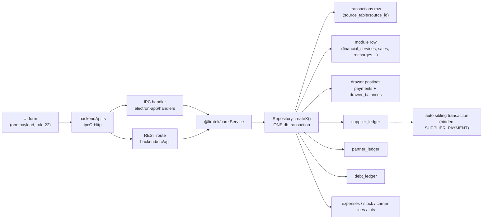

# Posting Map — every multi-ledger transaction and what it writes

> **What this is.** One business action in LiraTek (an OMT transfer, a POS sale, a recharge…)
> rarely writes one record. It writes a `transactions` row **and** a set of *postings* into
> several ledgers: drawers, the supplier ledger, the partner ledger, the customer account
> (debt ledger), expenses, stock, carrier lines. This document lists, per transaction type and
> mode, **every posting it writes, who reverses it, and where the code is.**
>
> **Why it exists.** On 2026-10-06 the owner found that a FOR-partner OMT SEND of $500 never
> appeared on the OMT supplier page. Root cause: that one path skips the supplier posting that
> every other OMT path writes — and nothing in the codebase lists, per path, which postings are
> required, so nothing noticed. This map is that list. It is the input for choosing a structural
> fix (§8), not a fix itself.
>
> **Snapshot.** Built 2026-10-06 against `main` @ `008f2c9a` by seven read-only code audits (one
> per module group), assembled and spot-checked by hand. `file:line` references drift — trust
> the symbol name over the line number. Paths are relative to `packages/core/src/` unless
> written otherwise.
>
> **Confidence.** Rows marked ✔ were re-read by hand while building this map. Everything else is
> as reported by an audit that cited the code; treat it as *likely* until someone touches that
> path. Gaps in §7 carry their own status.

---

## 1. Vocabulary

| Term | Meaning here |
| --- | --- |
| **Compound (multi-ledger) transaction** | One business event that posts to two or more ledgers in one DB transaction. |
| **Posting** | One record written into one ledger (a drawer leg, a `supplier_ledger` row, a `partner_ledger` row, a `debt_ledger` row…). |
| **Posting rule** | One row in this map: "transaction X in mode Y posts Z to ledger L". |
| **Leg** | A payment line in `payments[]`. IN = customer pays / money arrives; OUT (`direction: "OUT"`) = change / payout. |
| **Auto sibling** | A row the *system* writes because another transaction needed it (`is_auto`, CLAUDE.md rule 26). E.g. the hidden `SUPPLIER_PAYMENT` behind every auto supplier-ledger row, the SMS-fee `EXPENSE`. |
| **Reversal owner** | The code that undoes a posting on void/refund (CLAUDE.md rule 20). |
| **Counterparty ledger** | Supplier, partner or customer-account ledger (as opposed to drawers). |
| **PCD** | Primary Cash Drawer — `OMT_System` or `Whish_System`, whichever provider is the shop's base system (`shop_base_system`). Physical cash, not a float. |
| **x / f / c** | Transfer principal / customer-facing provider fee / the shop's commission (its cut of `f`). |

---

## 2. The ledgers and their sign conventions

| Ledger | Table(s) | Balance formula | Meaning of a positive balance | Notes |
| --- | --- | --- | --- | --- |
| **Drawers** | `payments` (journal) + `drawer_balances` (running) | Σ `payments.amount` per drawer/currency | money in the drawer | `ClosingRepository.recalculateDrawerBalances` rebuilds balances from `payments` — so a drawer delta with **no** `payments` row is undone by a recompute. |
| **Supplier ledger** | `supplier_ledger` | Σ `amount_usd` / `amount_lbp` over rows with `is_refunded = 0` | **shop owes the supplier** | `TOP_UP`, `STOCK_INTAKE`, `RECORDED_DEBT` positive; `PAYMENT` forced negative (`SupplierRepository.addLedgerEntry`); `SETTLEMENT`, `DISCOUNT` negative; `SUPPLIER_PAYS_US` negative for a commission credit, positive for a cash receive; `ADJUSTMENT` either sign. **An OMT/WHISH RECEIVE is a *negative* `TOP_UP`**, never `PAYMENT` (PAYMENT would be force-negated twice). |
| **Partner ledger** | `partner_ledger` | Σ DEBIT − Σ CREDIT (amounts unsigned) | **partner owes the shop** | DEBIT = partner owes more / shop paid partner. CREDIT = shop owes more / partner paid shop. FIFO "coverage" (`covered_amount`) applies only to `FOR_%` rows. |
| **Customer account** | `debt_ledger` | Σ amounts per client | **client owes the shop** | Module charges are named `'<Module> Debt'` (`Sale Debt`, `Recharge Debt`, `Service Debt`, `Custom Service Debt`, `Loto Debt`, `Maintenance Debt`); store credit is `CREDIT_DEPOSIT` (negative). Baskets use `Session Debt` with `transaction_id NULL`, `session_id` set. |
| **Expenses** | `expenses` + an `EXPENSE` transaction + its drawer leg | — | — | Auto expenses link back via `source_ref_table/source_ref_id`; `is_auto` is derived from that link in one place (`ExpenseRepository.createExpense`). |
| **Stock** | `products.stock_quantity`, `stock_batches`, `stock_batch_consumptions`, `product_units` | — | — | FIFO cost feeds the sale's profit stamp. |
| **Carrier lines** | `carrier_lines`, `carrier_line_movements` | Σ line credits | — | Invariant (LIRA-252): the MTC/Alfa drawer equals Σ its lines' credits. |
| **Exchange lots** | `exchange_lots`, `exchange_lot_settlements` | — | — | FIFO for exotic currencies; realised profit on the sell. |
| **Profit** | `transactions.profit_usd/profit_lbp` | — | — | Stamped at creation on almost every path. *Deferral* (unpaid debt, partner not yet collected, commission awaiting settlement) happens **read-side** in `ProfitRepository` (`notDebtPending`, `partnerCoverageRatio`), never by withholding the stamp. |

---

## 3. The common shape



**Today every repository decides its own postings inline, branch by branch.** There is no
declared list of required postings per path, and no shared check that a path wrote all of them.
That is the property this map makes visible.

Example — the call chain for an OMT transfer, desktop and web:

```
Services/index.tsx (api.addOMTTransaction)
  → frontend/src/api/backendApi.ts addOMTTransaction
      ├ electron-app/handlers/omtHandlers.ts  "omt:add-transaction"
      └ backend/src/api/services.ts           POST /api/services/transactions
  → services/FinancialService.ts addTransaction
  → repositories/FinancialServiceRepository.ts createTransaction
```

---

## 4. Posting maps per module

> **Typed source of truth (phase 5, in progress).** The rows below are being encoded as
> `POSTING_RULES` in [`packages/core/src/constants/postingRules.ts`](../packages/core/src/constants/postingRules.ts)
> — transaction type × mode → for each of drawers / supplier / partner / customer account:
> *must post* (with its amount formula), *must not post*, or *unchecked* (with a reason).
> Tests assert a path against its rule with `expectPostingsMatchRule`
> (`repositories/testHelpers/postingAssert.ts`), and `constants/__tests__/postingRules.guard.test.ts`
> fails CI for any transaction type that has neither a rule nor a named exclusion.
> **Encoded so far:** §4.1 OMT/WHISH (walk-in, THROUGH base, THROUGH secondary, FOR, basket),
> §4.3 MTC/Alfa (recharge walk-in / account / FOR / basket / DAYS, credit buy-back cash and
> account, line create / edit as `CARRIER_LINE_ADJUSTMENT`), the §4.2 rows for
> `selfChargeTelecomItem`, the four `RECHARGE_TOPUP` writers and `cashoutToSupplier`
> (`WALLET_CASHOUT`), §4.4 Loto tickets (walk-in, account, FOR), and the drawers &
> counterparties family — §4.6 drawer cash-out and §4.7 drawer top-up (external / from a drawer),
> drawer transfer, checkpoint (non-carrier drawers), supplier pay / receive / manual drawer
> payment / paper adjustment / stock intake / recorded debt / per-supplier settlement (model 1,
> non-bills), partner settle / Add Credit-Debt (cash and paper), and client / partner / bundled
> supplier write-offs (`DrawersCounterparties.postingRules.test.ts`). `MTC_TOPUP` / `ALFA_TOPUP`
> are excluded as `retired` (no writer since Phase 8.2). Carrier lines are not one of the four
> ledgers the table covers; `RechargeCarrier.postingRules.test.ts` checks line credits move with
> the carrier drawer beside each rule. Where this prose and the table disagree, the table is what
> the tests enforce — change both in the same commit. (2026-10-07: three §4.2/§4.3 cells below
> were stale against the code and were corrected while encoding — DAYS line credits, MTC/Alfa
> `topUpApp`, and the supplier-row condition on `topUpFromSupplier`. Same day, §4.7 "Manual
> supplier entry with drawer" still said "one `payments` row only" and "as given"; the code
> follows the G8 fix — one row per currency. The §4.7 rows
> for stock intake, recorded debt, paper adjustment, bundled discount, client write-off and the
> top-up / transfer split were added from the code.)

Legend: **—** = no posting. "drawer +X" = one `payments` row + one `drawer_balances` delta.

### 4.1 OMT / WHISH system transfers — `FinancialServiceRepository.createTransaction`

Shared by every row below:
- `financial_services` row with `commission_model = 1` and `is_settled = 0` → **every** OMT/WHISH
  SEND/RECEIVE enters the supplier **Settle queue** (`getUnsettledBySupplier`, which has no
  partner filter ✔; and, for the OMT account, `getAccountUnsettled`).
- Supplier amount comes from **`grossOwedDelta`**: SEND `+(x + f)`, RECEIVE (cutover) `−x`. The
  commission `c` is **not** netted — it is entered at settlement as a `SUPPLIER_PAYS_US` credit. ✔
- Supplier posting is skipped when the provider is the **secondary** system
  (`skipSecondarySupplierLedger`) or no supplier row exists. Both booking sites used to sit in an empty `try {} catch {}`; removed by LIRA-258 (working tree)
  — a failed supplier posting now rolls the transaction back. ✔
- Every auto supplier row gets a hidden `SUPPLIER_PAYMENT` sibling transaction, back-linked by
  `source_ref_table = 'financial_services'`, `source_ref_id = fs.id`.

| Mode | Drawer | Supplier ledger | Partner ledger | Customer account | Code |
| --- | --- | --- | --- | --- | --- |
| Walk-in SEND | +(x+f+pm) on PCD for cash, wallet drawer for wallet legs | `TOP_UP +(x+f)` ✔ | — | CUSTOMER_ACCOUNT leg → `Service Debt` | generic booking `~:4174-4308` |
| Walk-in RECEIVE, cash | −payout on PCD | `TOP_UP −x` ✔ | — | — | `postPayoutLegs` `~:4103` |
| Walk-in RECEIVE, wallet cashout | −payout on OMT_App / Whish_App | `TOP_UP −x` | — | — | `~:4036` |
| Walk-in RECEIVE, account cashout | — | `TOP_UP −x` | — | `CREDIT_DEPOSIT −payout` | `~:3964` |
| WHISH RECEIVE fee legs (`feePayments`) | +leg on resolved drawer | (as RECEIVE) | — | CA leg → `Service Debt` | `bookFeeCollectionLegs ~:2377` |
| Session basket (`deferPayment`) | — (basket posts pooled legs) | **still booked** | — | basket `Session Debt` | `~:3556` |
| THROUGH partner, base system | as walk-in | as walk-in | `THROUGH_{OMT\|WHISH}_{SEND\|RECEIVE}`: SEND = CREDIT, RECEIVE = DEBIT, amount **\|x\| only** | as walk-in | `~:4314-4352` |
| THROUGH partner, secondary system | cash → **General** | — (by design: partner carries it) | as above | as walk-in | `skipSecondarySupplierLedger` |
| **FOR partner SEND** (OMT/WHISH; LIRA-258, owner D1 2026-10-06 — fixed in working tree, not yet committed) | **— none** (obligations only, FEATURE_GUIDE §8.1.0); OUT legs **rejected** | `TOP_UP +(x+f)` from `grossOwedDelta`, back-linked to the `financial_services` row (generic void cascade reverses it) | `FOR_{OMT\|WHISH}_SEND` DEBIT = the same `x+f` (from `grossOwedDelta`) | — (CA leg rejected) | early return (line refs pre-LIRA-258: `~:2581-2915`) |
| FOR partner RECEIVE ✔ | — (obligations only, FEATURE_GUIDE §8.1.0) | `TOP_UP −x` | `FOR_{OMT\|WHISH}_RECEIVE` CREDIT = x | — | `~:2838-2900` |
| Walk-in on secondary system | **rejected** | | | | `~:1381` |
| FOR partner on secondary system | **rejected** (`BusinessRuleError`) | | | | `~:1409` |

Profit: OMT/WHISH model-1 rows stamp **0** commission at creation (plus kept change); the
commission is recognised at settlement. WHISH RECEIVE stamps its fee `f` immediately (not for FOR).

### 4.2 App wallets, Binance, iPick/Katsh catalog — `FinancialServiceRepository`

Wallet providers (OMT_APP, WHISH_APP, BINANCE) are balances the shop **owns**: transfers move the
wallet drawer and create **no** supplier debt ("Fix B", `isWalletProvider`). Catalog providers
(iPick, Katsh, app grids) use the **prepaid-units** model: supplier debt is booked **once at
top-up**, sales only draw the provider drawer down.

| Scenario | Drawer | Supplier ledger | Partner ledger | Customer account | Other |
| --- | --- | --- | --- | --- | --- |
| Catalog sale, walk-in (iPick/Katsh/app grid) | provider drawer −cost; customer legs + | — (prepaid) | — | non-drawer legs → `Service Debt` (needs `clientId`) | GIFT_CARD redeemed |
| Katsh BILL, model 1 | provider −cost; customer legs + | — at creation; commission at settlement | — | as above | enters Settle queue if supplier `commission_eligible` |
| Katsh BILL, legacy model 0 | as above | `SUPPLIER_PAYS_US −20,000 LBP` + hidden sibling | — | | |
| Wallet SEND, walk-in | wallet −amount (Binance in USDT); customer legs + | — | — | CA leg → `Service Debt` (auto-creates client) | 0-delta COMMISSION row |
| Wallet RECEIVE, walk-in | wallet +amount; payout legs − | — | — | CA → `CREDIT_DEPOSIT` | always reconciled |
| FOR partner, catalog | provider −cost | — | `FOR_IPICK` / `FOR_KATSH` / `FOR_*_APP_SEND` DEBIT = **price** | — | credit return runs |
| FOR partner, Binance SEND | USDT −amount | — | `FOR_BINANCE_SEND` DEBIT = amount + fee, **USD** | — | |
| FOR partner, app SEND | OUT legs debited | — | `FOR_*_APP_SEND` DEBIT = Σ legs | — | |
| FOR partner, app/Binance RECEIVE | wallet +amount | — | `FOR_*_RECEIVE` CREDIT = amount − fee | — | |
| THROUGH partner (any) | walk-in drawers | walk-in | `THROUGH_<KEY>_<TYPE>`, amount \|amount\| | walk-in | OMT_APP/WHISH_APP collapse to `OMT`/`WHISH` key |
| Credit return (Only-Days) | carrier drawer +credits (USD) | — | — | — | carrier line +credits (`ONLY_DAYS_RETURN`) |
| `selfChargeTelecomItem` | provider −cost LBP; carrier drawer +credits (full face) | — | — | — | `TELECOM_SELF_CHARGE`; line +credits +validity |
| Top-up from supplier (iPick/Katsh/OMT_APP) — `RechargeRepository.topUpFromSupplier` | destination drawer +amount | `TOP_UP +amount` (supplier created / re-activated if missing — G10) | — | — | `RECHARGE_TOPUP` |
| Whish App credits bought from a client — `RechargeRepository.topUpFromClient` | payout legs −(amount − fee); Whish_App +amount | — | — | — | `RECHARGE_TOPUP`; fee = profit stamp |
| OMT App cashout to supplier — `cashoutToSupplier` | OMT_App −amount | `PAYMENT −(amount + commission)` + hidden sibling | — | — | commission recognised at `settleAccount` |

### 4.3 MTC / Alfa recharge and carrier lines — `RechargeRepository`, `CarrierLineRepository`

| Scenario | Drawer | Supplier | Partner | Customer account | Carrier line | Auto siblings |
| --- | --- | --- | --- | --- | --- | --- |
| Recharge sale (credit transfer / voucher / top-up / gift / shop-line) | customer legs +; carrier drawer −face value (USD) | — (prepaid) | — | non-drawer legs → `Recharge Debt`; CA change → `CREDIT_DEPOSIT` | primary line −(amount + SMS cost) | Credit transfer: `EXPENSE SMS_Transfer_Fee`, `is_auto`, carrier drawer −smsCost |
| DAYS sale | customer legs +; carrier drawer −daysCostUsd | — | — | as above | validity −days and credits −daysCostUsd (G15 / D4); owed-delivery row if sold ahead | — |
| Session basket | stock legs + SMS expense only | — | — | basket `Session Debt` | as sale | as sale |
| FOR partner | stock leg + SMS expense | — | `FOR_RECHARGE` DEBIT = price | — | as sale | as sale |
| Credit buy-back | payout legs −; carrier drawer +credits; `<drawer>_LINE_DRIFT` correction leg | — | — | CA payout → `CREDIT_DEPOSIT` | primary line +credits | — |
| Drawer top-up into a provider wallet (`topUpApp`) | source −, wallet + | — | — | — | — (MTC/Alfa refused as targets since G15) | — |
| Line create / edit / toggle / archive | carrier drawer ±delta (`CARRIER_LINE_ADJUSTMENT`) | — | — | — | line set | — |
| Line usage (`recordUsage`) | carrier drawer −delta | — | — | — | movement −delta | `EXPENSE Line_Usage` (no `source_ref`, so not `is_auto`) |

Profit: `price − cost` stamped at creation; SMS fee is a separate expense, so net profit depends
on that expense row existing.

### 4.4 Loto — `LotoTicketRepository`, `LotoCashPrizeRepository`, `LotoCheckpointRepository`

| Scenario | Drawer | Supplier (LOTO) | Partner | Customer account |
| --- | --- | --- | --- | --- |
| Ticket sale | IN legs +, OUT legs − | `TOP_UP +(sale − commission)` LBP, linked by `transaction_id` (posts in every mode, incl. basket and FOR) | FOR: `FOR_LOTO` DEBIT = sale | CA legs → `Loto Debt` |
| Cash prize | General −prize LBP (skipped in basket) | `CASH_PRIZE −prize` | — | — |
| Ticket prize (`markWinner` / `payPrize`) | — | — | — | — (only the ticket row changes) |
| Checkpoint settlement | caller's IN legs as given | `SETTLEMENT +net` (**`transaction_id` NULL**, supplier falls back to id 1) | — | — |

### 4.5 POS sales, debts, sessions, stock — `SalesRepository`, `DebtRepository`, session services

| Scenario | Drawer | Supplier (product) | Partner | Customer account | Stock | Profit |
| --- | --- | --- | --- | --- | --- | --- |
| Draft autosave | — | — | — | — | — | — |
| Completed sale | IN legs +; cash change − on General; wallet OUT − | — (event-based model) | — | partial / CA → `Sale Debt`; CA change → `CREDIT_DEPOSIT`; gift card → voucher owner `CREDIT_DEPOSIT` | qty −, FIFO consume, unit SOLD | Σ(price − FIFO cost) − discount + kept change |
| FOR-partner sale | — (IN legs rejected) | — | `FOR_POS` DEBIT = final amount | — | as sale | as sale |
| Whole-sale refund | every leg mirrored | — | opposite row per entry | `Refund Reversal` of `Sale Debt` **and** `CREDIT_DEPOSIT` | restored | REFUND row −profit |
| Item refund | legs × line share | — | **— (no reversal)** | `Refund Reversal` of `Sale Debt` share, USD only | restored for q | −line margin |
| Undo item refund | refund legs re-posted | — | — | `Sale Debt` re-charged | re-consumed | +line margin |
| Session basket checkout | pooled legs (`session_id`, `transaction_id NULL`) | — | **— (FOR skipped under defer)** | one `Session Debt` | per sale | per sale + `KEPT_CHANGE` row |
| Session item refund | remainder as OUT legs | — | — | `Session Item Refund` credit | restored | −Σ line profit |
| Debt repayment | IN legs + (no drawer-affecting filter); OMT/WHISH share routed into the system drawer | — | — | `Repayment −amount`; FIFO marks `sales.paid_usd` | — | kept change |
| Debt discount / write-off | — | — | — | `Debt Discount −amount` | — | −forgiven |
| Credit cash-out / cash-in / adjustment | ± per leg (none on paper path) | — | — | `CREDIT_USED` / `CREDIT_DEPOSIT` / `Manual Debt` | — | 0 |
| Receive stock (`receiveStock`) | — | `STOCK_INTAKE +qty×cost` (only if a supplier is linked) | — | — | batch + stock + adjustment row | 0 |
| Record supplier debt | — | `RECORDED_DEBT +amount` | — | — | — | 0 |

### 4.6 Exchange, custom services, maintenance, expenses, hold money

| Scenario | Drawer | Supplier | Partner | Customer account | Profit |
| --- | --- | --- | --- | --- | --- |
| Exchange, walk-in | General +amountIn; payout legs − | — | — | — | stamped; exotic lots FIFO |
| Exchange, FOR partner | payout lump only | — | `FOR_EXCHANGE` DEBIT = \|amountIn\| (USD/LBP only) | — | coverage-deferred |
| Wallet exchange | same wallet: −in, +out | — | — | — | 0 |
| Custom service, walk-in | legs ± (**cost moves no drawer**) | — | — | CA / gift card → `Custom Service Debt` | price − cost + kept change |
| Custom service, FOR partner | — | — | `FOR_CUSTOM_SERVICE` DEBIT = price | — | coverage-deferred |
| Custom service, Via partner IN | as walk-in | — | `THROUGH_CUSTOM_SERVICE` CREDIT = cost | as walk-in | **immediate** |
| Custom service, Via partner OUT (Syria-style payout) | General −cost | — | `THROUGH_CUSTOM_SERVICE` DEBIT = price | — | **immediate** |
| Maintenance checkout (`processPayments`) | each drawer leg +; change always CASH/General − | — | — | residual → `Maintenance Debt` | parts margin + labour + kept change |
| Expense, manual (bill + cash handed, payer "shop") | method drawer −handed (per currency; BINANCE → USDT); change the vendor returned: +leg into its method's drawer on the SAME transaction | — | — | — | expense row = cost = handed − returned (change not returned is added to the cost, never profit); a negative side from cross-currency change is converted into the bill currency at the tender rate; no profit stamp, no KEPT_CHANGE row. Reversal: generic `_reversePayments` |
| Hold Money pickup (HOLD_MONEY_COLLECT, payer "payout") | payout legs debit their drawers: −(held − kept), one-currency pickups only for kept; no OUT legs (refused) | — | — | — | hold clears in full; verified kept in the row's own profit stamp (Profits "Hold Money" card + By Module row, day close). Reversal: `voidPickup` (HOLD_MONEY_COLLECT_VOID mirrors the legs and stamps the negative profit) |
| Expense, shop uses own inventory — `EXPENSE_INVENTORY` (LIRA-262, `ExpenseRepository.createStockExpense`) | **— none** (no `payments` row); stock: `products.stock_quantity −qty` + FIFO batch consumption (`stock_batch_consumptions.expense_id`, reason `ADJUSTMENT`) | — | — | — | expense row `amount_usd` = FIFO cost → net profit −cost (txn stamps 0) |
| Expense, shop uses a Katsh / iPick / Whish App item — `EXPENSE_KATSH` / `EXPENSE_IPICK` / `EXPENSE_WHISH_APP` (LIRA-262) | provider drawer (`Katsh` / `iPick` / `Whish_App`) −`cost_lbp × qty` LBP, one leg noted `Cost: <provider>` (internal, not customer cash); **no cash drawer** | — (prepaid at top-up) | — | — | expense row `amount_lbp` = cost → net profit −cost (txn stamps 0) |
| Hold money drop-off / pickup / void pickup | legs ± | — | — | — (liability lives in `hold_money`) | 0 |
| Drawer cashout | General − | — | — | — | — |

### 4.7 Counterparty operations — `SupplierRepository`, `PartnerRepository`, `PartnerService`

| Operation | Transaction type | Drawer | Supplier ledger | Partner ledger | Profit |
| --- | --- | --- | --- | --- | --- |
| Supplier settle (`settleTransactions`) | `SUPPLIER_SETTLEMENT` | net-pay legs − (cash → PCD for OMT/WHISH) | `SETTLEMENT −net`; stamps rows settled | — | commission (model 1) |
| ↳ commission, non-bills | (hidden sibling) | — | `SUPPLIER_PAYS_US −commission` | — | on settlement txn |
| ↳ commission, bills-only | same txn | provider drawer +commission (or other-payment legs +) | — | — | on settlement txn |
| Supplier account settle (`settleAccount`: OMT + OMT_APP + iPick) | `SUPPLIER_SETTLEMENT` | legs × (PAY −1 / COLLECT +1) | one row per member netting it; surplus `PAYMENT` on parent | — | commission + cashout commission |
| Supplier pay / receive cash (`recordSupplierCashflow`) | `SUPPLIER_PAYMENT` | PAY −legs / RECEIVE +legs | `PAYMENT −Σ` / `SUPPLIER_PAYS_US +Σ`; FIFO on purchases | — | 0 (+discount if bundled) |
| Manual supplier entry with drawer (`addLedgerEntry` PAYMENT + `drawer_name`) | `SUPPLIER_PAYMENT` | drawer as given, one `payments` row per currency (G8) | as given | — | 0 |
| ↳ bundled supplier discount (`recordSupplierCashflow` PAY + `discount`) | `COUNTERPARTY_DISCOUNT` (own txn) | — | `DISCOUNT −d` | — | +d |
| Supplier paper adjustment (`addLedgerEntry` ADJUSTMENT, no drawer) | `SUPPLIER_ADJUSTMENT` | — | `ADJUSTMENT ±x` | — | 0 |
| Supplier stock intake (`ProductRepository.receiveStock` → `recordStockIntake`) | `SUPPLIER_STOCK_INTAKE` | — | `STOCK_INTAKE +qty×cost` (USD, cents); stock + cost batch | — | 0 |
| Supplier recorded debt, no products (`recordDebt`) | `SUPPLIER_RECORDED_DEBT` | — | `RECORDED_DEBT +x` per currency | — | 0 |
| Partner settle | `PARTNER_SETTLEMENT` | ±amount per leg (partner owed → +, shop owed → −; `CLIENT_ACCOUNT` → none) | — | `SETTLEMENT` + FIFO coverage of `FOR_%` rows | gates FOR profit |
| Partner Add Credit / Debt | `PARTNER_PAYMENT` (cash) / `PARTNER_ADJUSTMENT` (paper) | ± if cash | — | as given | 0 |
| Partner write-off | `COUNTERPARTY_DISCOUNT` | — | — | `DISCOUNT` | signed |
| Client debt write-off (`DebtService.writeOffDebt`; customer account `Debt Discount −x`) | `COUNTERPARTY_DISCOUNT` | — | — | — | −x |
| Whish App top-up via partner | `RECHARGE_TOPUP` | Whish_App +amount | — | `WHISH_TOPUP` CREDIT | — |
| Drawer top-up, external (`createTopUp`) | `DRAWER_TOPUP` | General +amount | — | — | — |
| Drawer top-up from a drawer (`createTopUpFromDrawer`) | `DRAWER_TOPUP` | source −amount, General +amount (both journaled, G9/G33) | — | — | — |
| Drawer transfer (`transferBetweenDrawers`) | `DRAWER_TRANSFER` | from −amount, to +amount | — | — | — |
| Daily checkpoint | `CHECKPOINT` | adjustment legs (physical − book) | — | — | — |

---

## 5. Reversal owners (rule 20)

Generic path: `TransactionRepository._voidTransactionInternal` / `_refundTransactionInternal`.

| Ledger | Reversed by | Found via |
| --- | --- | --- |
| Drawers | `_reversePayments` (mirror rows; refund may substitute `refundLegs`) | `payments.transaction_id` |
| Basket pooled legs | `_reverseSessionPooledPayments` | `session_id`, `transaction_id IS NULL` |
| Customer account (module charges) | `_cancelDebt` → `Refund Reversal` | `transaction_id` + `MODULE_DEBT_TRANSACTION_TYPES` + `CREDIT_DEPOSIT` |
| Customer account (repayment) | `_restoreRepaymentDebt` + reverse-FIFO | `source_id` |
| Customer account (basket) | `_cancelSessionDebt` | `session_id` |
| Supplier ledger, auto sibling | `_cascadeSupplierSiblingVoid` (voids the sibling txn) | `source_ref_table/source_ref_id`, `is_auto = 1` |
| Supplier ledger, own row | `_markSourceRefunded` (soft-void) | `source_id` |
| Supplier ledger, link mode | `_reverseLotoSupplierLedger`, `_reverseLotoCashPrize`, `_reverseSupplierLedgerByTransactionLink` | `transaction_id` |
| Supplier settlement | `_reverseSupplierSettlement` + `_reverseCommissionAtSettlementRecords` | `transaction_id` / `source_id` |
| Partner ledger (FOR_/THROUGH_) | `_reversePartnerLedger` (opposite-direction row, same type) | `reference_table/reference_id` |
| Partner settlement / payment | `_reversePartnerSettlementLedger` + `_unwindPartnerSettlementCoverage` | `source_id` |
| Auto expense | `_cascadeExpenseSiblingVoid` | `expenses.source_ref_*` |
| Profit | REFUND row negates; VOID sets original `VOIDED` | — |
| Stock | `_restoreStock`, `_restoreCustomServiceStock`, `_restoreMaintenancePartsStock`, `_reverseSupplierStockIntake`, `_reverseProductUnits` | sale items / batch `transaction_id` |
| Stock, shop-use expense (LIRA-262) | `_restoreExpenseStock` → `restoreExpenseStock` (`expenseStock.ts`; `stock_restored` guard) — plus `_reversePayments` for the provider leg and `_markSourceRefunded` for the expense row | `expenses.item_source/item_id/item_quantity`, `stock_batch_consumptions.expense_id` |
| Carrier lines | `_reverseCarrierLineMovements` | `carrier_line_movements.transaction_id` |
| Exchange lots | `_reverseExchangeLotEffects` (guarded by `_assertExchangeLotsVoidable`) | `source_id` |

Module-owned reversals: sale item refund + undo (`SalesRepository`), session basket void/refund/
item refund + undo (`TransactionRepository`), split checkout (`voidCheckoutGroup`), hold-money
pickup void (`HoldMoneyRepository.voidPickup`).

`NON_REVERSIBLE_TRANSACTION_TYPES` (25, `constants/transactionTypes.ts`): LOTO_CASH_PRIZE,
LOTO_SETTLEMENT, REFUND, CREDIT_CASH_OUT, CREDIT_CASH_IN, DEBT_CASH_OUT, KEPT_CHANGE,
PARTNER_ADJUSTMENT, ACCOUNT_ADJUSTMENT, SUPPLIER_ADJUSTMENT, COUNTERPARTY_DISCOUNT, MTC_TOPUP,
ALFA_TOPUP, DRAWER_TOPUP, DRAWER_CASHOUT, HOLD_MONEY, HOLD_MONEY_COLLECT, HOLD_MONEY_COLLECT_VOID,
LOTO_MONTHLY_FEE, CHECKPOINT, CARRIER_LINE_ADJUSTMENT, CLIENT_CREATED, CLIENT_UPDATED,
CLIENT_DELETED, REFUND_UNDO. Their owner is a manual opposite entry or the module's own page.

---

## 6. Cross-module invariants this map implies

These are the rules the tables above *should* satisfy. They are not enforced anywhere as one
check today.

1. **Every OMT/WHISH transaction on the base system has exactly one supplier posting** —
   `grossOwedDelta(row)` — whatever the mode (walk-in, basket, THROUGH, FOR).
2. **Settle-queue membership implies a supplier posting.** A row `getUnsettledBySupplier` lists
   must have the matching `supplier_ledger` row, or settling it moves the balance the wrong way.
3. **Partner amount equals the obligation, not the payment mechanics.** FOR rows should owe a
   formula (`x + f`, `price`), not "whatever legs were sent".
4. **Every posting has a reversal owner and a link column it is found by.**
5. **Every drawer delta has a `payments` row** — otherwise `recalculateDrawerBalances` erases it.
6. **A compound transaction is atomic.** All postings commit together or none do; a counterparty
   posting is never "non-critical".
7. **Carrier drawer = Σ carrier line credits** (LIRA-252).

---

## 7. Gaps found

Status: **Verified** = re-read by hand · **Reported** = cited by an audit, not yet re-checked ·
**Unverified** = the audit itself flagged it as not traced end-to-end.

### 7.1 Money — wrong or missing balances

| # | Gap | Effect | Status |
| --- | --- | --- | --- |
| G1 | **FOR-partner OMT/WHISH SEND writes no supplier posting.** Early return before the generic booking; the SEND arm has none (the RECEIVE arm does). `FinancialServiceRepository.ts ~:2731-2770, :2913` | "I owe OMT" missing — the owner's 2026-10-06 report | Verified · **Fixed in working tree (LIRA-258, not yet committed)** |
| G2 | **Same row is still in the Settle queue** (`is_settled = 0`, no partner filter). Settling it writes a negative settlement posting for `x + f` against nothing | OMT balance flips to "OMT owes you" | Verified for the per-supplier route (`getUnsettledBySupplier` → `settleTransactions`). **Likely** for the OMT *account* route (`getAccountUnsettled` → `settleAccount`, `useSuppliers.ts:699`), which unions the same pending rows and nets each member — not traced end-to-end · **Fixed in working tree for the FOR-partner SEND case (LIRA-258, not yet committed)** — the row now carries its `+(x+f)` supplier posting, so settling it nets correctly |
| G3 | **THROUGH on the secondary system sits in the unsettled set with no supplier posting** (only the supplier card is hidden) | same class as G2 if ever settled | Fixed in working tree (LIRA-258): second-system THROUGH rows are no longer supplier-pending |
| G4 | **Supplier posting failures are swallowed** (`try {} catch {}` at both OMT/WHISH booking sites); missing supplier row only logs at debug | transaction commits without its supplier posting | Fixed in working tree (LIRA-258): no swallowed catch; missing/inactive supplier is created or re-activated |
| G5 | **Item refund of a FOR-partner POS sale never reverses `FOR_POS`**, and afterwards the whole-sale route is blocked | partner keeps owing for refunded items — no owner | Fixed in working tree (LIRA-258): item refund writes an opposite FOR_POS row for the refunded share; undo re-posts it (coverage follow-up: G36) |
| G6 | **FOR-partner sale inside a session basket writes no partner posting** (skipped under `deferPayment`) | partner never owes | Fixed in working tree (LIRA-258): a FOR-partner sale inside a basket is refused (no screen can produce it) |
| G7 | **Maintenance can double-charge**: a fully on-account / deferred checkout leaves no `payments` row, so re-saving a paid status runs `processPayments` again | second MAINTENANCE txn + second debt | Fixed in working tree (LIRA-258): the second save of a paid job posts nothing; re-charging after a refund now works |
| G8 | **Manual supplier PAYMENT in USD + LBP writes one `payments` row for two drawer deltas** | the LBP leg vanishes on a drawer recompute | Fixed in working tree (LIRA-258): one payments row per currency |
| G9 | **Drawer → drawer top-up debits the source drawer with no `payments` row** | erased by a drawer recompute | Fixed in working tree (LIRA-258): source drawer debit is journaled |
| G10 | **Top-up from supplier skips the supplier posting silently when no supplier row matches** (drawer still credited) | debt to supplier missing | Fixed in working tree (LIRA-258): ensureSystemSupplier on top-up/cashout; refused if no supplier can be produced |
| G11 | **Supplier / partner operations are not atomic** (`addLedgerEntry`, partner settle / credit / debt) | half-written postings, coverage applied without money | Fixed in working tree (LIRA-258): supplier addLedgerEntry and partner settle/payment run in one db transaction |
| G12 | **POS completion retry re-books stock, FIFO, Sale Debt, FOR_POS and credits without reversing them** (only payments are reversed) | doubled postings on retry | Fixed in working tree (LIRA-258): completing an already-completed sale is refused |
| G13 | **`DebtService.addCredit` failures are ignored by the sale path** | sale commits without the customer's store credit | Fixed in working tree (LIRA-258) in POS, recharge, custom services, OMT/Whish/wallet flows and session baskets (addCreditOrThrow) |
| G14 | **Loto: no leg reconciliation; gift-card and CA-change legs silently dropped; editing a ticket changes no posting** | drawer / debt / supplier drift | Fixed in working tree (LIRA-258): legs reconciled, gift card redeemed, CA change booked, FOR legs refused, ticket money fields locked |
| G15 | **DAYS sale and `topUpApp` move the MTC/Alfa drawer without a matching line-credit move** | breaks invariant 7 until the next buy-back drift leg absorbs it | Fixed in working tree (LIRA-258): DAYS sale lowers line credits by the days cost; topUpApp refuses MTC/Alfa (owner D4) |
| G42 | **Client-sent kept change is booked with no server check** in POS (`SalesRepository` stamps `profit_usd + kept_change_usd`), Maintenance (`MaintenanceRepository` `keptChangeUsd/Lbp` into the profit stamp), session checkout (`SessionCheckoutService` writes a standalone `KEPT_CHANGE` profit row), Debts repayment (`DebtRepository.addRepayment` profit = `kept_change_*`) and Custom Services (`CustomServiceRepository` adds `kept_change_*` to profit). None of the five calls `reconcileLegs` (grep: 0 calls in Sales, Maintenance, CustomService, SessionCheckoutService; Debts' repayment documents it has none) | a hand-built payload can book any kept amount as profit | **Fixed (LIRA-266, 2026-10-07)** — all five call `resolveKeptChange` (payer customer) before any write when kept is claimed; the profit stamp uses only the verified kept. POS refuses kept on a deferred (basket) sale, Maintenance drops it (the basket owns it), Custom Services books none on basket items and refuses kept on a payout; session checkout reconciles over the net charge `grossCharge − grossPayout + Σ PAYOUT legs` (PAYOUT legs never count as change) and keeps its standalone `KEPT_CHANGE` row of the verified kept; partner transactions refuse kept. Guards: `SalesRepository.keptChange`, `MaintenanceRepository.keptChange`, `SessionCheckoutService.keptChangeReconcile`/`.keptChangeForPartner`, `DebtRepository.keptChange`, `CustomServiceRepository.keptChange` tests. Open: the check runs only when kept is claimed (owner question: reconcile every sale/basket) |
| G43 | **Payout repositories treat an OUT leg as a drawer DEBIT, but on a payout an OUT leg would be cash coming back INTO the drawer.** `FinancialServiceRepository` `processReturnLegs` debits every drawer-affecting OUT leg (`-amt`); `DebtRepository.cashOutCredit` debits every leg regardless of `direction` and runs no reconcile | `cashOutCredit`: an OUT leg debits the drawer instead of crediting it. FSR system RECEIVE: the IN-only reconcile in `postPayoutLegs` refuses an overpaid payout before anything posts, so the likely effect there is a refused save, not a drawer error | **Fixed (LIRA-266, 2026-10-07)** — every payout page uses `payer="payout"` (no change fields, no OUT legs) and the servers refuse OUT legs: FSR non-catalog RECEIVE (system and wallet), `processCreditBuyback`, `topUpFromClient`, `DebtRepository.cashOutCredit` (also refuses CUSTOMER_ACCOUNT/GIFT_CARD legs and reconciles payout legs = credit reduction − kept), Hold Money pickup. Kept change on payouts goes through `resolveKeptChange` (payout) and into the row's profit stamp; tender moves −(owed − kept). Guards: `FinancialServiceRepository.receiveKeptChange`, `RechargeRepository.payoutKeptChange`, `DebtRepository.keptChange`, `HoldMoneyRepository.keptChange` tests |

### 7.2 Profit timing

| # | Gap | Status |
| --- | --- | --- |
| G16 | Via-partner custom service (`THROUGH_CUSTOM_SERVICE`) counts profit immediately, while FOR rows wait for partner coverage | Fixed in working tree (LIRA-258): THROUGH_CUSTOM_SERVICE payout DEBIT deferred by partner coverage and covered by settlements (owner D5) |
| G17 | On-account recharge / loto inside a basket: `Session Debt` has no `transaction_id`, so `notDebtPending` cannot hold that profit back | Unverified |
| G18 | Deferred WHISH RECEIVE stamps fee profit though no fee cash is posted on that transaction | Checked: counted once — correct, no change (guard test added) |
| G44 | **Debts repayment routes kept change into FIFO / PCD attribution but not into the ledger.** `DebtRepository.addRepayment` computes `totalUSD/LBP = IN − OUT` (kept change still inside) for the summary and FIFO attribution, while the `debt_ledger` reduction uses the client's `amount_usd/lbp`, which excludes kept. The two figures disagree by exactly the kept amount whenever change is kept | attribution (and any PCD routing fed by it) over-applies by the kept amount | **Fixed (LIRA-266, 2026-10-07)** — FIFO sale/service coverage and PCD routing use the applied amount (IN − OUT − kept); a void now unwinds exactly the coverage it applied. Guard: `DebtRepository.keptChange.test.ts` (failed first: next charge covered 1 vs 0, routing 101 vs 100) |
| G45 | **For-Partner transfer in a customer basket booked twice** — the cart item carried the customer total while the partner ledger also booked it; checkout asked the walk-in for it (OMT SEND $100 + $5 → $125 asked; paying booked $105 as cash AND partner debt); a For-Partner RECEIVE made checkout refuse | same money owed by partner and taken from customer | **Fixed (LIRA-274, 2026-10-07)** — `utils/sessionForPartnerItem.ts`: a For-Partner item contributes 0 to the basket customer charge on client and server; partner/supplier postings unchanged; void/refund nets to 0. Guard: `SessionCheckoutService.forPartnerSystemSend.test.ts` |
| G46 | **Refund kept change only on SALE / DEBT_REPAYMENT** — other modules' REFUND rows were never read by Profits | kept profit invisible | **Fixed (LIRA-272, 2026-10-07)** — REFUND row profit = −original + kept; kept also in `metadata_json.refund_kept_change_usd/lbp`, read by `ProfitRepository.getRefundKeptChangeProfit` (Overview, Kept Change By Module row, By Date, day close); cash/wallet drawer −(refund − kept); sale item-refund undo takes it back off on the undo's day. 2026-10-07 owner decision: dated by the REFUND's own day for every module incl. SALE (`refundKeptChangeDay`); sale ledger and By Cashier/Client subtract it from the original-day stamp (`stampNetOfRefundKeptChange`). Guard: `ProfitRepository.refundKeptChangeRefundDay.test.ts`. Guard: `ProfitRepository.refundKeptChangeModules.test.ts` |
| G32 | THROUGH-partner transfer on the second system: profit is stamped 0 (model-1 rule) and waits for a supplier settlement that never happens, so the shop fee is never counted as profit. Owner rule (D7, 2026-10-06): the fee is 100% profit, counted immediately | Fixed in working tree (LIRA-258): shop fee stamped as profit at creation |
| G33 | Drawer-to-drawer top-up from a source drawer with no balance row for that currency credited General and debited nothing (money from nowhere). Found 2026-10-06 | Fixed in working tree (LIRA-258): source debited via applyDrawerDelta (may go negative, owner 2026-08-01 rule) |
| G34 | Voiding a wallet-paid OMT/WHISH SEND with a payment-method fee left the wallet short by the fee (_reversePayments applied a drawer delta for the audit-only PM_FEE row). Found 2026-10-06 | Fixed in working tree (LIRA-258): AUDIT_ONLY_PAYMENT_METHODS skipped for drawer deltas on reversal |
| G35 | recalculateDrawerBalances counted audit-only PM_FEE rows as money, inflating a rebuilt wallet by the fee. Found 2026-10-06 | Fixed in working tree (LIRA-258): rebuild excludes AUDIT_ONLY_PAYMENT_METHODS |
| G36 | Partner settlement coverage (FIFO) ignores reversals: a refunded FOR row still absorbs settlement money, so profit on the partner's later sales stays deferred. Found 2026-10-06 | Fixed in working tree (LIRA-258): coverage and the profit ratio use the net obligation after reversals (one definition in partnerObligation.ts) |
| G37 | Whole-sale refund of a gift-card-paid sale reverses the voucher credit but leaves the voucher redeemed — the customer loses its value. Found 2026-10-06 | Fixed in working tree (LIRA-258): whole-sale refund/void restores the voucher to pending |
| G38 | Item refund of a POS sale linked to an open session basket still skips the FOR_POS share (G5) and the change-credit share (G21). Found 2026-10-06 | Checked: unreachable on current code (a session-linked sale can be neither FOR-partner nor carry its own change credit); guard tests added, no source change |
| G39 | Web app: a client's gift cards never loaded as a payment option (`fetchClientVouchers` called `window.api` directly — rule 19). Found 2026-10-06 | Fixed in working tree (LIRA-258): routed through `vouchersGetAll` (`ipcOrHttp`) |
| G40 | Suppliers page Transactions history: a voided row showed "Unpaid", still consumed manual payments in the FIFO (a later real row could read Unpaid) and counted in the Outstanding total. Found 2026-10-06 on cornertech | Fixed in working tree (LIRA-258): FIFO status "voided", skipped by the pool; page shows a grey "Voided" tag and leaves it out of the tallies |
| G41 | Desktop `AddExpenseSchema` had no `transaction_time` key, so Zod stripped a backdated manual expense's time on desktop only (rule 23). Found 2026-10-06 | Fixed in working tree: key added (literal mirror of core's transactionTimeSchema) |

### 7.3 Reversal coverage

| # | Gap | Status |
| --- | --- | --- |
| G19 | Session item refund can be undone for SALE members only (not RECHARGE / CUSTOM_SERVICE) | Won't fix — owner D6 (undo refund stays POS-only) |
| G20 | Auto-sibling cascades always use VOID semantics, even from a refund | Checked: label difference only — every balance and profit nets to 0; no change |
| G21 | Item refund cancels `Sale Debt` only (USD only) — not the CA-change credit or voucher credit; voucher status never flips back | Fixed in working tree (LIRA-258): item refund cancels the change-as-credit share pro rata (both currencies); voucher credit left as is by design |
| G22 | `CustomServiceRepository.deleteService` hard-deletes both original and reversal `payments` rows (drawer nets to 0, journal lost) | Fixed in working tree (LIRA-258): delete keeps the payments journal |
| G23 | Loto settlement supplier row has no `transaction_id`; no code owner reverses a settlement | Fixed in working tree (LIRA-258): settlement row linked, supplier resolved, legs reconciled, market rate |

### 7.4 Consistency and labelling

| # | Gap | Status |
| --- | --- | --- |
| G24 | FOR-partner OMT/WHISH SEND partner amount = Σ legs, not the `x + f` the supplier side would use — nothing cross-checks them | Verified · **FOR half fixed in working tree (LIRA-258, not yet committed)** — partner DEBIT now uses the same `x+f` from `grossOwedDelta` |
| G25 | THROUGH partner amount excludes the fee (`\|x\|`) while the supplier side is gross | By design — owner D7 (partner owed = amount; fee is the shop's) |
| G26 | THROUGH ledger key collapses OMT_APP → `OMT`, WHISH_APP → `WHISH` (FOR keeps them distinct) | Fixed in working tree (LIRA-258): THROUGH_OMT_APP_* / THROUGH_WHISH_APP_* keys |
| G27 | `SUPPLIER_PAYS_US` and `TOP_UP` auto rows get transaction type `SUPPLIER_PAYMENT` (no map entry) | Kept SUPPLIER_PAYMENT by choice; entry_type already in metadata (a new type would ripple into ~10 readers) |
| G28 | Payment-method fee stored but never posted on catalog and wallet flows | Fixed in working tree (LIRA-258): single payment credits amount + pm fee on catalog/wallet flows |
| G29 | Exchange has no keep-change posting: `ExchangeRepository` has no kept-change fields (verified by grep). Whether the Exchange page exposes the shared keep-change toggle is **unchecked** — if it does, kept change is silently dropped and this belongs in §7.1 | Fixed in working tree (LIRA-258): Exchange payout keep-change (round down, keep < $1 / < 100,000 LBP as profit) (owner D9) |
| G30 | `Line_Usage` expense has no `source_ref` → not `is_auto`; `ExpenseRepository` comment claims five auto writers, only one passes `source_ref` | Checked: Line_Usage is operator-initiated, correctly not is_auto; comment fixed |
| G31 | Stale comments: FOR SEND "cash → General" (code resolves to PCD); FOR RECEIVE direction described both ways; `RECHARGE_TOPUP` called non-reversible; `LOTO_CASH_PRIZE` called permanently non-reversible | Reported |

---

## 8. What the map tells us about the architecture

1. **Postings are decided by control flow, not declared.** Each repository branches on
   provider × service type × partner mode × defer × payment shape and writes postings inline.
   A branch that returns early (G1) or forgets a mode (G5, G6) silently drops a posting, and no
   test fails because no test knows the full list.
2. **The same obligation is computed in more than one place.** Supplier side uses
   `grossOwedDelta`; FOR partner side uses Σ legs; THROUGH partner side uses `|x|`. Rule 14 says
   one definition (G24, G25).
3. **Read-side state can disagree with write-side postings.** The Settle queue is a query over
   `financial_services` flags; the balance is a sum over `supplier_ledger`. Nothing guarantees a
   queued row has its ledger row (G2, G3).
4. **"Non-critical" counterparty postings.** Swallowed `catch` blocks and early `return`s treat a
   ledger posting as optional (G4, G10, G13). For a money app, a posting is either required or
   it is not in the map.
5. **Reversal is generic by link column, which works well** — every posting with a correct link
   is reversed for free. The holes are exactly the postings written without a link or outside the
   generic path (G5, G21, G23).

Fix options to weigh next (not decided here):

- **A — Patch per path.** Fix G1/G2 inside `FinancialServiceRepository` the way FOR RECEIVE
  already works. Smallest change; leaves the class open.
- **B — Posting rules as data + one guard.** Encode §4 as a typed table
  (`transactionType × mode → required ledgers`), and add a post-commit assertion (in tests, and
  optionally at runtime) that a created transaction wrote exactly the required postings. Branches
  stay where they are; drift fails loudly.
- **C — One posting engine.** Repositories return a list of intended postings; a single
  `PostingEngine` validates them against the rules, writes them atomically, and attaches link
  columns so the reversal path stays generic. Largest change; removes the class.

---

## 9. Keeping this map honest

- **Any change that adds, removes or re-routes a posting updates §4 in the same commit** —
  the same habit as rule 30's release note.
- When a gap in §7 is fixed, strike it and cite the commit; do not delete the row.
- If option B or C is adopted, the typed rules table replaces §4 as the source of truth and this
  file links to it.
