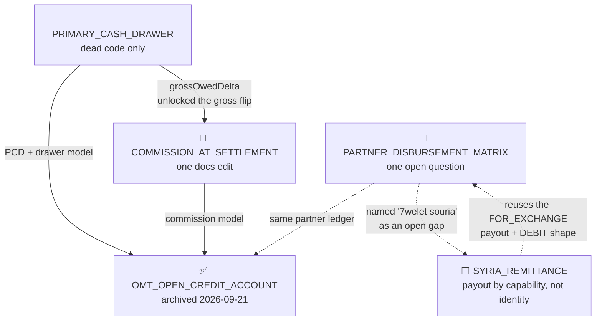
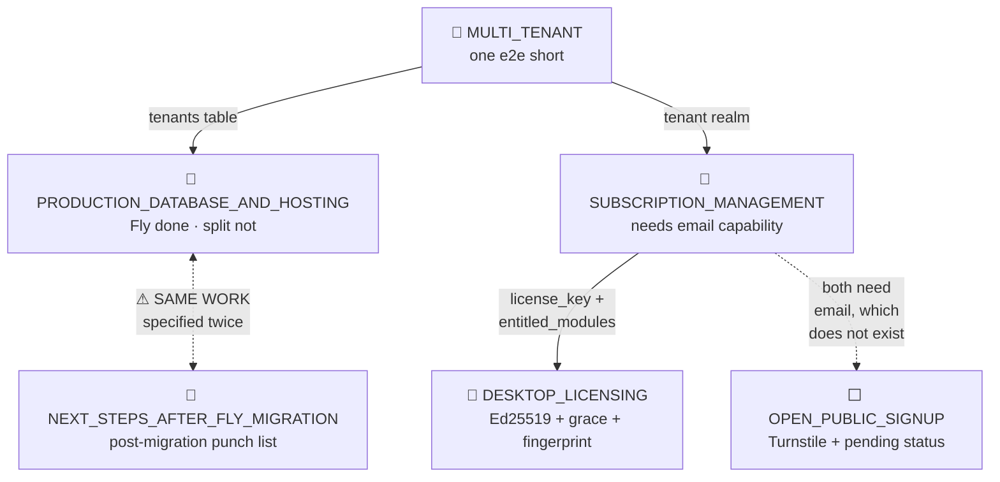
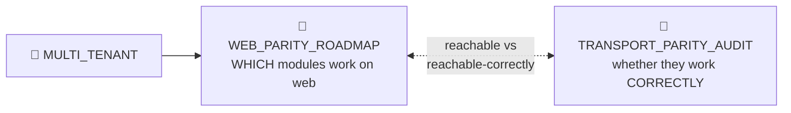
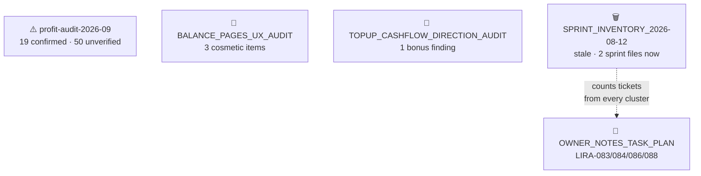

# Plan Overview — the live board, verified against source

> **This is a LIVING DOCUMENT. Never archive it.** Like `WEB_PARITY_ROADMAP.md`, it has no
> completion state — it is the map, not a plan.
>
> **Scope: only work that is still open.** Finished plans are not listed here; they live in
> `done_plans/` as the design record. This page is what is left, and nothing else.
>
> **Built 2026-09-16** by reading every plan in `todo_plans/` + `ongoing_plans/` and checking
> **each** claimed artifact against source — the migration, the table/column, the constant, the
> repository method, the REST route, the component, the spec file. **No status line was taken at
> face value.** Where a plan's header disagreed with the code, the code won.

---

## 0. How to read this, and how it got clean

The 2026-09-16 sweep checked 26 plans and found **11 of them finished and filed as unfinished** —
42% of the board. Those 11 have been archived, and 7 more that had genuinely started were moved
out of `todo_plans` (which means "nothing built yet") into `ongoing_plans`.

**The sweep left a real board of 17 plans** — much smaller than the folders used to suggest.
**Now 19** — counted from the folders, not from this line's history: **13 ongoing + 6 todo**.
`OMT_OPEN_CREDIT_ACCOUNT_PLAN.md` was archived 2026-09-21 when its confirming web run came back
green — the last thing it was waiting on.
`SYRIA_REMITTANCE_PLAN.md` was added 2026-09-17; `LIRA-194` was opened by the owner on
2026-09-20; `LIRA-196` was split out of the `lira-web-027` investigation on 2026-09-21 so the
narrow fix could ship without waiting on an owner decision about tenant timezones.

Two plans were opened **and** closed on 2026-09-20 without ever outliving a day on this board:
`REMAINING_DESKTOP_E2E_FAILURES.md` (4 desktop specs) and `LIRA-195` (4 web specs). Both were
stale-spec fixes, both are archived in `done_plans/`, and both moved in the same change as
their code — which is the habit described below actually being followed rather than described.

**Why the rot happened, in one line:** a status line is written once, when the plan is written,
and whoever later ships the work updates the code and the sprint file but not the plan. Six of
the eleven archived plans were completed by a commit landing *days after* that plan's own internal
"validation pass" declared the item missing.

**Two habits that prevent a repeat:**

1. When you finish a plan's last item, **move the file in the same commit as the code.**
2. When a plan says a phase is missing, **`ls` or `grep` for the artifact before believing it.**
   That single check would have caught all eleven.

---

## 1. The live board

**Size** is the remaining work only, not the original plan. **Money** means the remaining work
writes transactions, payments, drawers, ledgers or profit.

### `ongoing_plans/` — started, unfinished (13)

| Plan | What's actually left | Size | Money |
| --- | --- | --- | --- |
| `PRIMARY_CASH_DRAWER_PLAN.md` | Cosmetic tail only. Dead `getBalance()` closure (`DrawerTopUpRepository.ts:617`), unused `primaryCashDrawerName` import (`FinancialServiceRepository.ts:23`), ~3 JSDoc blocks still describing the withdrawn `InsufficientDrawerFundsError` as live. **Header still says "PLANNED" — it shipped long ago** | Small | no |
| `COMMISSION_AT_SETTLEMENT_PLAN.md` | One doc edit. Phases 2-3 shipped (`43948a35`, `8c453764`, `8a868fe3`); Phase 4 required rewriting `docs/COUNTERPARTY_LEDGERS.md` for the gross/at-settlement model and that never happened. **Header still claims "Phases 2-4 NOT started"** | Small | no |
| `MULTI_TENANT_IMPLEMENTATION_PLAN.md` | **WP9 only** — a browser e2e covering super-admin → provision → impersonate → tenant isolation. Everything else is live: `tenantContext.ts`, admin routes, impersonation banner, CI scoping linter | Small | yes |
| `TOPUP_CASHFLOW_DIRECTION_AUDIT.md` | 1 finding. Primary scope fixed (`7b076724`); the self-declared "bonus finding" is open — `EXCHANGE` is hardcoded `direction: "both"` (`transactionPresentation.ts:80`), ignoring the for-partner variant | Small | no (badges) |
| `BALANCE_PAGES_UX_AUDIT.md` | 3 of 7 convergence items, all cosmetic. Critical colour bugs fixed (`d40fd6e5`, shared `balanceColor.ts`). Open: unify money formatters, Partners reversal-row marker, "Refunded" vs "VOIDED" wording | Small | no |
| `PARTNER_DISBURSEMENT_MATRIX.md` | **No code — one unanswered question.** All 3 money-risk findings fixed (`2e9e822a`, `43c7450e`). The audit flagged an assumption that was never put to you: should "we always pay" extend to **FOR-mode RECEIVE**? | Question only | yes |
| `SUBSCRIPTION_MANAGEMENT_PLAN.md` | `tenants.email` + grace-period notices — needs a mail capability that **does not exist anywhere in the repo**; plus one e2e. Its §7 is stale: the "no owner UI" gap was closed by `PlanModal.tsx` (`e78da1b3`) | Medium | yes |
| `TRANSPORT_PARITY_AUDIT_PLAN.md` | Phase 3 (type the 31 `any` adapter fns, money paths first), Phase 4 (rule C1 + allowlist across 19 `window.api?.` components), and `scripts/check-transport-parity.mjs` — **which does not exist**. One of the few headers that tells the truth | Medium | yes |
| `OWNER_NOTES_TASK_PLAN.md` | LIRA-083 (custom-service work-status lifecycle), LIRA-084 (partial keep-change), LIRA-086 (checkpoint value-drift colouring). Plus LIRA-088, blocked on your answer | Medium | LIRA-088 only |
| `DESKTOP_LICENSING_PLAN.md` | Phases 1-5: `last_check_in` + machine fingerprint, Ed25519-signed licence blob, key moved to `userData`/`safeStorage`, 30-day grace UI, clock-tamper freeze. Its own "🔴 URGENT" hazard was already fixed by `805fc45a` — *one minute before the doc was committed* | Large | yes |
| `PRODUCTION_DATABASE_AND_HOSTING_PLAN.md` | Phases A-D, the per-tenant database split. Phase 0 passed; Fly + Litestream are live. `connection.ts` still has one module-level `db` and a parameterless `getDatabase()`, untouched since April | Large | yes |
| `NEXT_STEPS_AFTER_FLY_MIGRATION.md` | `DATABASE_KEY` log line still lies (no canary in `sqlcipher.ts:39`); signup URL-code prefill; **plus the per-tenant split, which is the same work as the row above** — see §4 | Large | yes |
| `WEB_PARITY_ROADMAP.md` 📖 | **Living tracker — never archive.** Phase 3 count is badly stale: it says "7 of 87 specs, ~43 remain"; today there are **117 desktop specs against the same 7-spec allowlist, so ~110 remain**. Two §9 items are already fixed but still listed | Large | yes |

### `todo_plans/` — genuinely not started (6)

| Plan | What's there | Size | Money |
| --- | --- | --- | --- |
| `LIRA-194_TOPUPS_MUST_BE_VOIDABLE.md` 🔴 | **HIGH (owner, 2026-09-20).** A top-up cannot be undone — `RECHARGE_TOPUP` sits in `NON_REVERSIBLE_TRANSACTION_TYPES`, so the only remedy is an opposite manual entry. Four writers (`topUpApp`/`topUpFromSupplier`/`topUpFromPartner`/`topUpFromClient`) must each post a real `payments` row and gain a named reversal owner. LIRA-192's `cashoutToSupplier` is the working template. **Partial fixes are worse than none** — the type is shared | Medium | yes |
| `LIRA-196_TENANT_DAY_BOUNDARY.md` 🆕 | **`'localtime'` is the SERVER's timezone, not the shop's.** ~43 date queries across 10 repositories say "today" and mean the server's day. On desktop that is Beirut and correct; on Fly (UTC) a Beirut shop's day rolls over at **03:00 local**, so midnight-to-3am money is attributed to the previous day — silently, never zero, never throwing. Rule 27, 4th+ instance. **Blocked on one owner decision: where does a tenant's timezone live?** | Medium | yes (reporting) |
| `SYRIA_REMITTANCE_PLAN.md` 🆕 | Everything. A custom transfer provider that can **pay OUT** — today `useSystemDrawerFlow = isOMT \|\| isWHISH` (`FinancialServiceRepository.ts:2878`) means any other provider's RECEIVE **credits** the drawer instead of debiting it. Mostly reuse: the `ExchangeRepository` FOR-partner posting shape + the existing provider taxonomy. **6 owner decisions first** — D6 asks whether to reverse the recorded "Syria belongs in Custom Services" position | Medium | yes |
| `OPEN_PUBLIC_SIGNUP_PLAN.md` | Everything: Turnstile (zero matches repo-wide), `pending` tenant status (CHECK still `active/suspended/archived`), verified contact email, URL invite-code prefill. The signup page it gates already shipped. **The only plan whose header is honest about being untouched** | Large | no |
| `profit-audit-2026-09/` ⚠️ | **19 confirmed profit divergences, unfixed — and 50 more that were never actually checked.** See §3 | Large | yes |
| `SPRINT_INVENTORY_2026-08-12.md` 🗑️ | A stale snapshot, not a build plan. Its counts are no longer trustworthy and a **second** ticket file now exists that it never knew about (`docs/tickets/CURRENT_SPRINT.md`). Re-run it or drop it | Re-run | no |

---

## 2. The work queue

### 2a. Tidy-ups — one day total, closes 4 plans outright

1. `COMMISSION_AT_SETTLEMENT` — rewrite `docs/COUNTERPARTY_LEDGERS.md` for the gross model.
2. `PRIMARY_CASH_DRAWER` — delete 2 dead symbols, fix ~3 stale JSDoc blocks.
3. `BALANCE_PAGES_UX_AUDIT` — 3 cosmetic convergence items.
4. `TOPUP_CASHFLOW_DIRECTION_AUDIT` — the EXCHANGE for-partner badge.

### 2b. Small and well-specified — closes 2 more

- ~~LIRA-191~~ built 2026-09-20; ~~`OMT_OPEN_CREDIT_ACCOUNT`'s confirming e2e run~~ green 2026-09-21 (desktop 312 + a clean full web run) — **plan archived to `done_plans/`**.
- ~~The 4 remaining desktop e2e failures~~ done 2026-09-20 — all four were stale SPECS, not product bugs; fixed and verified green (archived to `done_plans/`).
- **WP9** (`MULTI_TENANT`) — the super-admin/impersonation e2e.

### 2c. The four large tracks — pick ONE and finish it

| Track | Plans | Why you'd pick it |
| --- | --- | --- |
| **Money correctness** | `profit-audit-2026-09` | The only open item where the map itself is wrong about money (§3) |
| **Web maturity** | `TRANSPORT_PARITY_AUDIT` → `WEB_PARITY_ROADMAP` | The guard script *prevents* the defect class the 110 specs merely *detect* |
| **Commercial** | `SUBSCRIPTION_MANAGEMENT` → `DESKTOP_LICENSING` → `OPEN_PUBLIC_SIGNUP` | The only chain with real sequencing; needs an email capability nothing has built |
| **Infrastructure** | `PRODUCTION_DATABASE_AND_HOSTING` | Per-tenant DB split; resolve the duplicate in §4 first |

### 2d. Blocked on you — five entries, no code possible until answered

| Question | Plan |
| --- | --- |
| **D1-D6**: is the Syria counterparty always a partner; where does the commission sit; is profit deferred to settlement; own drawer or General; one corridor or many; **and does Syria move out of Custom Services at all?** | `SYRIA_REMITTANCE` |
| Should "we always pay" extend to **FOR-mode RECEIVE**? | `PARTNER_DISBURSEMENT_MATRIX` |
| LIRA-088: which balance did you mean — shop-SIM credits, or resale provider-drawer balance? | `OWNER_NOTES_TASK_PLAN` |
| D1: subscription pricing — per shop, per machine, or per seat? | `SUBSCRIPTION_MANAGEMENT` + `DESKTOP_LICENSING` |
| ~~Used the OMT account enough to start LIRA-191?~~ Answered yes 2026-09-20; built. | `OMT_OPEN_CREDIT_ACCOUNT` |

---

## 3. ⚠️ The one item that should worry you

**`profit-audit-2026-09/` misrepresents itself about money.**

It ran 228 agents over profit computation across 8 modules × 5 surfaces. Its summary says
*"73 divergences claimed, 19 confirmed"* — which reads as though the other 54 were checked and
cleared. They were not.

Every `verify` call for **recharge, financial_services, maintenance, loto and exchange** failed
with `You've hit your org's monthly spend limit` — **324 such failures** in `raw-workflow-result.json`.
Those five modules are recorded as *"0 confirmed / all refuted."* **That "refuted" is a billing
crash wearing a verdict's clothing.** Fifty claimed profit divergences were never examined.

What is solid: three modules got a real adversarial pass — sales (7 confirmed), custom_services
(8), expenses (4). Those **19 are real and, on a 2-of-19 spot check, still unfixed today** (no
shared `saleMargin` fragment exists anywhere in `packages/core/src`; `HistoryModal.tsx:204` still
hardcodes `<td>Cash</td>` for every expense row regardless of `paid_by_method`).

**Recommended: re-run the verify phase for the 5 crashed modules before trusting any label in that
directory, and treat the 19 as an open money-correctness backlog.**

---

## 4. One duplicate to resolve

**The per-tenant database split is specified twice** — `PRODUCTION_DATABASE_AND_HOSTING_PLAN.md`
Phases A-D and `NEXT_STEPS_AFTER_FLY_MIGRATION.md` item 3 are the same work in two documents.
Pick one owner (the former is far more detailed) and have the other point at it. Until then, two
plans both look Large for the same reason and the board over-counts the work.

---

## 5. Suggested order

1. **Answer the four questions in §2d.** Minutes of your time; unblocks four plans.
2. **Do the §2a tidy-ups** — one commit, clears four plans off the board entirely.
3. **Re-run the profit-audit verify phase** (§3). The only unknown that touches money.
4. **WP9** (§2b) — the one small item left there now that `OMT_OPEN_CREDIT_ACCOUNT` has closed.
5. **Then pick one large track from §2c** and finish it rather than starting several.

Do 1-4 and the board drops from 18 plans to 12, with only one genuinely large item per track left.

---

# 6. THE LINK MAP — how the live plans connect

Scope: `todo_plans/` + `ongoing_plans/` only. Archived plans are excluded even where a finished
plan was the parent of a live one.

**🔶 = partial · ⬜ = not started · 📖 = living · ⚠️ = compromised · 🗑️ = stale artifact**

### 6a. Supplier money & commission

What survives of what was the deepest dependency chain in the codebase. The chain itself is now
walked end to end — only a docs edit, some dead code and one deferred ticket remain.

**Reading it:** `PRIMARY_CASH_DRAWER` was the keystone — its `grossOwedDelta`/`resolveServiceCashDrawer`
made the commission gross-flip possible, which made the OMT open-credit account possible. Nothing
here blocks anything now. Total remaining across the first four: one doc rewrite, two dead symbols,
one deferred ticket, one question for you. **`SYRIA_REMITTANCE` is the one piece of real build work
left in this cluster** — and the cluster is why it is cheap: the partner ledger, the settlement UI
and the payout posting shape all already exist.

### 6b. Tenancy, hosting & commercialisation

**The only cluster where sequencing still matters.**

**Reading it:** `MULTI_TENANT` is the root and is essentially done. The live decision is which
branch to take — infrastructure (`PDH`, large) or commercial (`SUB → LIC`, also large).
**Both `SUB` and `OPEN` need a mail capability that exists nowhere in the repo**, so whichever you
do first pays that cost. `OPEN_PUBLIC_SIGNUP` is no longer blocked by anything: the invite-gated
signup page it sits behind has already shipped.

### 6c. Desktop ⇄ web parity

Two companions answering different questions about the same surface.

**Reading it:** not a dependency, a division of labour. `TRANSPORT_PARITY_AUDIT` is the
higher-value of the two right now — its Phase 3/4 guard script would *prevent* the defect class
that `WEB_PARITY_ROADMAP`'s remaining 110 specs would merely *detect*.

### 6d. Standalone audits & backlogs

No dependencies in either direction. Pick them up whenever.

### 6e. Master dependency table

Only **hard** dependencies (X must land before Y). ✅ marks a prerequisite that is already
satisfied.

| Plan | Blocked by | Unlocks |
| --- | --- | --- |
| `PRIMARY_CASH_DRAWER_PLAN` | – | `COMMISSION_AT_SETTLEMENT` ✅, `OMT_OPEN_CREDIT_ACCOUNT` ✅ |
| `COMMISSION_AT_SETTLEMENT_PLAN` | `PRIMARY_CASH_DRAWER` ✅ | `OMT_OPEN_CREDIT_ACCOUNT` ✅ |
| ~~`OMT_OPEN_CREDIT_ACCOUNT_PLAN`~~ *(archived 2026-09-21)* | `PRIMARY_CASH_DRAWER` ✅, `COMMISSION_AT_SETTLEMENT` ✅ | – |
| `PARTNER_DISBURSEMENT_MATRIX` | – | – |
| `SYRIA_REMITTANCE_PLAN` | – *(5 owner decisions, not a code dependency)* | – |
| `MULTI_TENANT_IMPLEMENTATION_PLAN` | – | `PRODUCTION_DATABASE`, `SUBSCRIPTION_MANAGEMENT`, `WEB_PARITY_ROADMAP` |
| `PRODUCTION_DATABASE_AND_HOSTING_PLAN` | `MULTI_TENANT` ✅ | – *(duplicated by `NEXT_STEPS_AFTER_FLY_MIGRATION`)* |
| `NEXT_STEPS_AFTER_FLY_MIGRATION` | – | – *(duplicates `PRODUCTION_DATABASE_AND_HOSTING`)* |
| `SUBSCRIPTION_MANAGEMENT_PLAN` | `MULTI_TENANT` ✅ | `DESKTOP_LICENSING` |
| `DESKTOP_LICENSING_PLAN` | `SUBSCRIPTION_MANAGEMENT` *(schema half ✅)* | – |
| `OPEN_PUBLIC_SIGNUP_PLAN` | – *(signup page already shipped)* | – |
| `WEB_PARITY_ROADMAP` | `MULTI_TENANT` ✅ | – |
| `TRANSPORT_PARITY_AUDIT_PLAN` | – | – |
| `OWNER_NOTES_TASK_PLAN` | – | – |
| `TOPUP_CASHFLOW_DIRECTION_AUDIT` | – | – |
| `BALANCE_PAGES_UX_AUDIT` | – | – |
| `profit-audit-2026-09` | – | – |
| `SPRINT_INVENTORY_2026-08-12` | – | – |

### 6f. What the shape tells you

- **Only one cluster has real sequencing** — tenancy/commercial (§6b). Everywhere else the plans
  are independent, so "what unlocks what" is almost never your constraint. **You can pick on value
  alone.**
- **The money core is finished.** §6a's chain is fully walked; what remains is a doc rewrite, two
  dead symbols and a ticket you chose to defer. This is not where your remaining work is.
- **11 of 17 live plans have no links at all.** Most of the board's apparent complexity was
  finished work nobody re-filed — and that has now been cleared.
- **The critical path for the commercial product** is
  `MULTI_TENANT ✅ → SUBSCRIPTION_MANAGEMENT → DESKTOP_LICENSING`, with an unbuilt email
  dependency sitting across it.

---

## Appendix — confidence

Every row was checked against source. Three carry caveats:

| Plan | Confidence | Why |
| --- | --- | --- |
| `profit-audit-2026-09` | **Low** | Partially-crashed automated run; 2 of 19 findings spot-checked, the rest assumed open |
| `WEB_PARITY_ROADMAP` | **Medium** | The 117-vs-7 spec count is a hard number, but the specs were not individually audited for shim status |
| `SPRINT_INVENTORY_2026-08-12` | **Medium** | Proven dated, but its 19 line items were not each re-verified against HEAD |
| All others | **High** | Named artifact located in source, or a clean negative grep for a specific unambiguous symbol |
