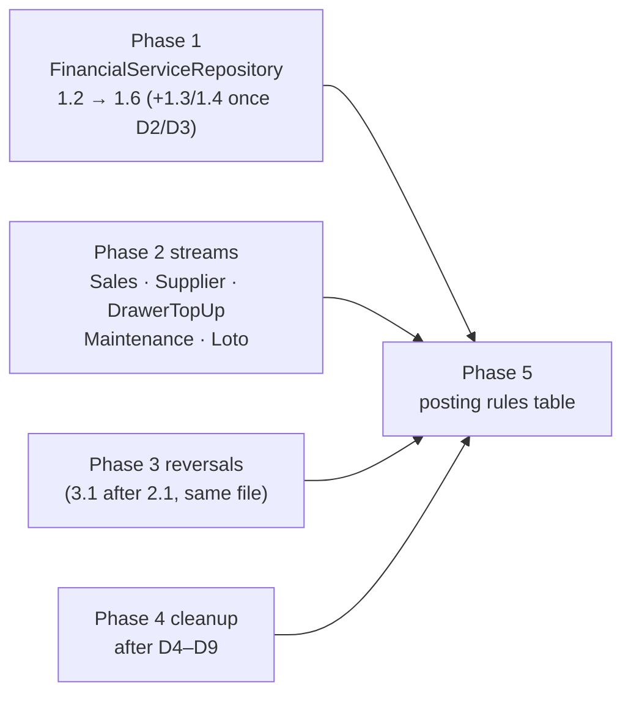

# Posting Integrity Plan — close the multi-ledger gaps

> **Status:** IN PROGRESS — batch 1 started 2026-10-06 (LIRA-258). Created 2026-10-06.
> **Overlap:** LIRA-257 (another session, same day) already seeds the seven system suppliers for
> every tenant (`db/systemSuppliers.ts`, migration v191). That covers the "seed on provisioning"
> half of D2; item 1.3 reuses it for the get-or-create path instead of adding a second definition.
> **Source of the gaps:** [`docs/POSTING_MAP.md`](../../POSTING_MAP.md) §7 (G1–G31). This plan
> does not repeat the gap text; it says what to do about each one. Visual summary:
> the "LiraTek Posting Gaps" artifact (owner's claude.ai gallery).
> **Proposed tickets:** LIRA-258 onward (LIRA-257 was taken by the supplier-seeding fix) (next free ID per `PLAN_OVERVIEW.md`). File each ticket
> in `current_sprint.md` when its work starts, not up front.

---

## 0. The goal in one paragraph

Every money transaction writes records into several ledgers. Today nothing lists which records
each path must write, so a branch that skips one fails no test (`POSTING_MAP.md` §8). This plan
fixes the gaps found on 2026-10-06 **and** adds the missing guard: a shared test helper that
proves, per path, "these exact records were written, and voiding nets every ledger to zero".
The helper grows into a typed table of posting rules once enough paths use it. A single posting
engine (option C) is out of scope unless the table shows the same class of bug keeps coming back.

---

## 1. Owner decisions — all answered 2026-10-06 (interview)

| # | Question | Answer | What it changes |
| --- | --- | --- | --- |
| D1 | FOR-partner OMT/WHISH SEND: what does each side owe? | Partner owes `x + f`; shop owes OMT `x + f` (whole fee to OMT, commission back at settlement); **no drawer moves**. | 1.2 |
| D2 | Supplier row missing or turned off? | **Create (or re-activate) it automatically**, the Loto way, and seed the system suppliers when a new web shop is provisioned. Never skip the debt silently. Finding behind it: new web tenants are provisioned with **no** OMT/Whish supplier rows (`TenantRepository` seed excludes them) and `getByProvider` ignores inactive suppliers, so today those shops skip every supplier posting. | 1.3, 2.2 |
| D3 | Through-partner transfers on the second system? | They are **not** supplier-pending (no supplier settlement ever applies). The Dashboard **Pending Settlement** banner covers what must be settled **in every ledger**, so they appear there as **partner** pending (e.g. "Ali: 3 pending — you owe $303"), cleared by settling the partner. | 1.4 |
| D4 | DAYS sale: do line credits really drop? | **Yes.** Selling days costs credit per month (e.g. 3 SMS × $0.30 for 30 days) and that credit leaves the line. A DAYS sale must lower the primary line's credits by the same `daysCostUsd` the drawer already loses. `topUpApp` into MTC/Alfa: same "drawer = Σ lines" rule — verify and align in 4.3. | 4.3 |
| D5 | Via-partner custom service profit timing? | **When the partner pays** (same coverage rule as FOR rows). | 4.2 |
| D6 | Undo refund in a basket for recharges / custom services? | **No — keep POS only.** G19 closed as "by design". | 3.3 dropped |
| D7 | Through-partner amounts? | **Amount = what the partner tells you to collect → owed to the partner** (today's behaviour, keep). **Fee = the shop's own fee → 100% profit, counted immediately** (today it is stamped 0 and never recognised — new gap **G32**). Add a form hint: "Amount = what the partner tells you · Fee = your shop fee". | 4.1 |
| D8 | Maintenance job re-saved as paid? | **Never charge twice.** Changing a payment means refunding it first. | 2.6 |
| D9 | Keep-change on Exchange? | **Yes, add it.** (Today the Exchange payment sheet never shows the toggle, so nothing is lost now.) | 4.6 |
| D10 | Old data? | **Reset everywhere, including cornertech.** No repair scripts. | all |

## 2. Ground rules for every item

- **Verify before fixing (rule 17).** 27 of the 31 gaps are *Reported* by an audit, not seen
  failing. Each money item starts with a guard test against **today's** code. It fails → the gap
  is real and the failing-first proof is recorded. It passes → the audit was wrong: strike the
  gap in `POSTING_MAP.md` §7 and drop the item. Nothing is fixed that nobody has seen fail.
- **Never re-break finished code to prove a test** (rule 17, owner decision 2026-09-26).
- **Tests that pin the wrong behaviour are rewritten, not deleted** (rule 24) — listed per item.
- **Every new record gets a reversal owner in the same change** (rule 20) and, if written by the
  system, `is_auto` derived from its link (rule 26).
- **Both transports** (rule 19): fixes live in `packages/core`, which desktop and web share; any
  form change is made once in the shared frontend.
- **Release note** (rule 30) for every change a cashier or owner can see.
- **`POSTING_MAP.md` updated in the same commit** as any posting change (its §9).
- **Shipping:** a push to `main` deploys to production (Vercel + Fly). Each batch needs the
  owner's go. Changes touching frontend and core deploy separately, so for a few minutes an old
  page can talk to a new server; batches with a payload change say so in their release step.

Gates per batch: core build + sync (`cp -r packages/core/dist/. node_modules/@liratek/core/dist/`),
`yarn typecheck`, `yarn lint`, core / backend / electron / frontend jest (check elapsed time, not
just exit code — rule 28a), desktop e2e via the CLAUDE.md procedure, web e2e for touched flows.

---

## 3. Phase 1 — the reported bug, and the helper that guards the whole class

**One stream, one file:** everything here edits `FinancialServiceRepository.ts`, so it ships as
one batch.

### 1.1 Posting test helper (built inside 1.2, not as its own project)

`packages/core/src/__tests__/helpers/postingAssert.ts`:

- `snapshotLedgers(db)` — drawer balances, Σ `payments` per drawer/currency, supplier balances
  (`getSupplierBalance`, non-refunded rows), partner balances, client debt balances, Settle-queue
  rows.
- `expectPostings(before, after, expected)` — asserts the **exact** delta per ledger and fails on
  any unexpected delta (a missing posting and an extra posting both fail).
- `expectVoidNetsToZero(txnId)` — voids through `TransactionRepository` and asserts every ledger
  is back to `before`, **per currency**.
- `expectQueueMatchesLedger(provider)` — every row the Settle queue lists has its supplier
  posting (invariant 2 in `POSTING_MAP.md` §6).

### 1.2 G1 + G2 + G24 — FOR-partner OMT/WHISH SEND (LIRA-258) — **Buildable now** (D1)

| | |
| --- | --- |
| Fix | In the FOR-partner SEND arm, split OMT/WHISH from OMT_APP/WHISH_APP (app wallets keep paying from the wallet — unchanged). For OMT/WHISH: refuse OUT legs (same as FOR RECEIVE); compute **one** `grossOwedDelta(...)` value; write the supplier `TOP_UP` with `source_ref_table/id` (so the generic sibling cascade reverses it — rule 20) and the partner `FOR_*_SEND` DEBIT from the **same** number. Pull the RECEIVE arm's supplier booking into one helper both arms call (rule 14). No empty `catch` in the new code. |
| Frontend | `Services/index.tsx` FOR SEND branch sends `payments: []` for OMT/WHISH; stop sending a non-CASH `paidByMethod` there, or hide the paid-by picker for that case. |
| Failing-first test | `partner.test.ts`: FOR OMT SEND (USD, LBP) writes supplier `+(x+f)`, partner `+(x+f)`, no drawer delta; void nets to 0; settling the queued row leaves the OMT balance at 0 (closes G2 for this case). One WHISH case with `shop_base_system = WHISH`. |
| Tests to rewrite | `partner.test.ts` :456 (PCD debited → unchanged), :483, :503 (amount from `x+f`, not legs), :584 ("[OPEN OWNER QUESTION]" → asserts the TOP_UP), :1661, the `disbursementLeg` helper's OMT uses; grep `OmtSystemFeeCharacterization.test.ts` for FOR SEND. E2E: `lira-119`, `lira-services-for-partner-ui`, `lira-118`, `lira-120`, and `lira-web-*` FOR specs that assert drawer deltas on an OMT FOR SEND. |
| Docs | `FEATURE_GUIDE.md` §8.1.0 and §7 PCD row: SEND joins RECEIVE as "obligations only". `PRIMARY_CASH_DRAWER_PLAN.md` §6 item 6a closed with D1. |
| Release note | Suppliers / OMT: "Sending an OMT or Whish transfer for a partner now shows on the OMT/Whish supplier page as money you owe, and no longer takes cash out of a drawer." |
| Size | M |

### 1.3 G4 — stop swallowing OMT/WHISH supplier booking errors — **Buildable (D2: auto-create)**

| | |
| --- | --- |
| Fix | One `ensureSystemSupplier(provider)` in `SupplierRepository` (get, re-activate if inactive, or create — the Loto pattern, rule 14) used by every auto supplier posting. Seed the system suppliers in tenant provisioning. Remove the empty `catch` at both booking sites: any other error propagates and rolls back the whole transaction. |
| Precondition | None for missing suppliers (they are created). Still worth a read-only owner check of which tenants were missing them, since those tenants have had no supplier postings so far (D10: reset, no repair). |
| Failing-first test | Supplier row deleted / set inactive → today the transaction commits with no supplier posting; after → the supplier exists and the posting is written. A forced ledger error rolls everything back. |
| Size | S |

### 1.4 G3 + G32 — second-system THROUGH rows: partner-pending, fee is profit — **Buildable (D3, D7)**

- Stamp second-system THROUGH rows as **not supplier-pending** (base-system check in
  `isPendingSupplierSettlement` / `pendingSettlementSql()`, one definition).
- Stamp the shop fee as profit at creation for these rows (G32, D7).
- Dashboard **Pending Settlement** banner becomes all-ledger: supplier lines (as today) plus
  partner lines from unsettled partner balances, e.g. "Ali: 3 pending — you owe $303" (D3).
- Form hint on the THROUGH-partner Services form: "Amount = what the partner tells you · Fee =
  your shop fee".
- Guards: `expectQueueMatchesLedger` over every OMT/WHISH mode; THROUGH-secondary profit = fee.
- Release note (Dashboard / Services). Size M.

### 1.5 G18 — basket WHISH RECEIVE fee profit — verify first

Guard test; if confirmed, gate `whishReceiveFeeProfit` on `!deferPayment` (the basket books the
fee). Size S.

### 1.6 Invariant sweep test

One parametrised core test that runs **every OMT/WHISH mode** (walk-in, basket, THROUGH base,
THROUGH secondary, FOR SEND, FOR RECEIVE × USD/LBP) through the helper and asserts invariants 1
and 2 of `POSTING_MAP.md` §6. This is the class guard: a future branch that skips the supplier
posting fails here. Size S.

---

## 4. Phase 2 — money balances in other modules (parallel streams)

Different repositories, so these can run side by side. Each starts with its failing-first guard.

| Item | Gaps | Repository | Fix | Decision | Size |
| --- | --- | --- | --- | --- | --- |
| 2.1 FOR-partner sale in a basket | G6 | `SalesRepository`, `SessionPaymentService` | Write `FOR_POS` even under `deferPayment`, and keep the partner sale out of the basket's money. Guard: partner balance +price, basket untouched, void nets to 0. | — | M |
| 2.2 Missing supplier on top-up | G10 | `RechargeRepository.topUpFromSupplier` | Use `ensureSystemSupplier` (D2); never credit the drawer without the debt. | D2 ✔ | S |
| 2.3 Ignored store-credit failure | G13 | `SalesRepository` (+ other `addCredit` callers) | Check the result; fail the sale if the credit is not written. | — | S |
| 2.4 Atomic counterparty operations | G11 | `SupplierRepository.addLedgerEntry`, `PartnerService.settle` / `recordPartnerTransaction` | Wrap each operation in one `db.transaction`. Guard: force the second write to throw, assert nothing was written. | — | M |
| 2.5 Drawer moves with no journal row | G8, G9 | `SupplierRepository` manual PAYMENT; `DrawerTopUpRepository.createTopUpFromDrawer` | One `payments` row per currency moved. Guard: after the operation, `recalculateDrawerBalances` changes nothing. | — | S |
| 2.6 Maintenance double charge | G7 | `MaintenanceService` / `MaintenanceRepository.processPayments` | Decide "already paid" from the MAINTENANCE transaction existing, not from `payments` rows. | D8 ✔ | S |
| 2.7 POS completion retry | G12 | `SalesRepository.processSale` | On retry, reverse **all** earlier postings (stock, FIFO, debt, `FOR_POS`, credits) before re-posting — or refuse a retry on a completed sale. Verify first. | — | M |
| 2.8 Loto leg reconciliation | G14 | `LotoTicketRepository` | Call `reconcileLegs`; handle GIFT_CARD and CA-change like Recharge; reject unknown methods. Editing a ticket's amount: refuse after creation, or re-post. | — | M |
| 2.9 Basket profit hold | G17 | `SessionPaymentRepository` / `ProfitRepository.notDebtPending` | Verify first. If real: let the hold match basket debt through the session link. | — | S |

---

## 5. Phase 3 — reversals (rule 20)

| Item | Gaps | Fix | Decision | Size |
| --- | --- | --- | --- | --- |
| 3.1 Partner share on item refund | G5 | `SalesRepository.refundSaleItem` reverses the refunded share of `FOR_POS` (pro rata, same currency) using the generic partner-reversal helper; the undo re-posts it. Guard: refund one of two items → partner balance falls by that item; undo restores it. | — | M |
| 3.2 Credits on item refund | G21 | Item refund also cancels the linked `CREDIT_DEPOSIT` share; voucher returns to usable when its credit is reversed. | — | S |
| 3.3 Undo refund scope | G19 | **Dropped** — D6: keep POS only. Document as by design. | D6 ✔ | — |
| 3.4 Cascade semantics | G20 | Verify first. If a refund should refund (not void) its auto siblings, add a refund-mode cascade. | — | S |
| 3.5 Custom-service delete journal | G22 | `deleteService` stops hard-deleting `payments`; rely on the void's reversal rows. | — | S |
| 3.6 Loto settlement | G23 | Link the `SETTLEMENT` row to its transaction; resolve the LOTO supplier explicitly (no `|| 1`); reconcile legs to net; name a reversal owner or keep it non-reversible with that reason documented. | — | M |

---

## 6. Phase 4 — one formula per obligation, labelling, cleanup

| Item | Gaps | Fix | Decision | Size |
| --- | --- | --- | --- | --- |
| 4.1 Partner amount function | G24 (rest), G25 | One `partnerOwedDelta(...)` beside `grossOwedDelta`: FOR = `x + f` (D1), THROUGH = amount (D7, unchanged). G25 closes as "by design". | D7 ✔ | S |
| 4.2 Via-partner profit timing | G16 | Include `THROUGH_CUSTOM_SERVICE` in the partner-coverage deferral. | D5 ✔ | S |
| 4.3 Carrier invariant | G15 | DAYS sale also moves the primary line's credits by `−daysCostUsd` (same movement row, reversed by the generic carrier-line reversal). Verify `topUpApp` into MTC/Alfa against the same rule and align it. | D4 ✔ | S–M |
| 4.4 Labels and types | G26, G27, G30 | Distinct THROUGH keys for app wallets (check reports first); map `SUPPLIER_PAYS_US` / `TOP_UP` to their own transaction types; give Line_Usage a source link so it is `is_auto`. | — | S |
| 4.5 Payment-method fee | G28 | Post the fee leg on catalog and wallet flows the way system SEND does. Verify first. | — | S |
| 4.6 Exchange keep-change | G29 | Build it (D9): pass `onKeptChange` from the Exchange page, add kept-change fields to the exchange schema/repository, stamp as profit, reversed by the REFUND row. | D9 ✔ | M |
| 4.7 Stale comments | G31 | Correct the four comments. | — | S |

---

## 7. Phase 5 — promote the helper to posting rules (option B)

Once phases 1–3 have put most money paths through `postingAssert`, move the expected postings
from individual tests into one typed table, `constants/postingRules.ts`
(`transactionType × mode → required ledgers and amount functions`). Tests then read the table,
and `POSTING_MAP.md` §4 links to it as the source of truth. Optional: a dev-only runtime check
that a created transaction matched its rule. **Option C (one posting engine)** is reconsidered
only if this table keeps catching the same class of gap.

---

## 8. Order and batches

1. **Batch 1:** 1.1 + 1.2 + 1.6 (buildable now). Then 1.3 / 1.4 / 1.5 as their decisions land.
2. **Batch 2:** 2.5, 2.4, 2.3 (no decisions, small).
3. **Batch 3:** 2.1 + 3.1 + 3.2 (all `SalesRepository` — one stream).
4. **Batch 4:** 2.6, 2.7, 2.8, 2.9, 3.5, 3.6.
5. **Batch 5:** phase 4 items as decisions arrive.
6. **Batch 6:** phase 5.

---

## 9. Coverage — every gap has a place

| Gap | Plan item | Notes |
| --- | --- | --- |
| G1 | 1.2 | D1 answered |
| G2 | 1.2 (this case), 1.6 (class) | account route (`settleAccount`) covered by 1.6 |
| G3 | 1.4 | D3 ✔ |
| G4 | 1.3 | D2 ✔ |
| G5 | 3.1 | |
| G6 | 2.1 | |
| G7 | 2.6 | D8 ✔ |
| G8 | 2.5 | |
| G9 | 2.5 | |
| G10 | 2.2 | D2 ✔ |
| G11 | 2.4 | |
| G12 | 2.7 | verify first |
| G13 | 2.3 | |
| G14 | 2.8 | |
| G15 | 4.3 | D4 ✔ — real gap |
| G16 | 4.2 | D5 ✔ |
| G17 | 2.9 | verify first (Unverified) |
| G18 | 1.5 | verify first |
| G19 | — | **Won't fix, by design** (D6) |
| G20 | 3.4 | verify first |
| G21 | 3.2 | |
| G22 | 3.5 | |
| G23 | 3.6 | |
| G24 | 1.2, 4.1 | |
| G25 | — | **By design** (D7: partner owed = amount) |
| G26 | 4.4 | |
| G27 | 4.4 | |
| G28 | 4.5 | verify first |
| G29 | 4.6 | D9 ✔ — build |
| G30 | 4.4 | |
| G31 | 4.7 | |
| G32 | 1.4 | new 2026-10-06: THROUGH-secondary shop fee never counted as profit (D7) |

---

## 10. Assumptions

- D10 answered: no data repair for any gap; affected shops (cornertech included) reset and retest.
- Line numbers in `POSTING_MAP.md` are from `main @ 008f2c9a` and will drift.
